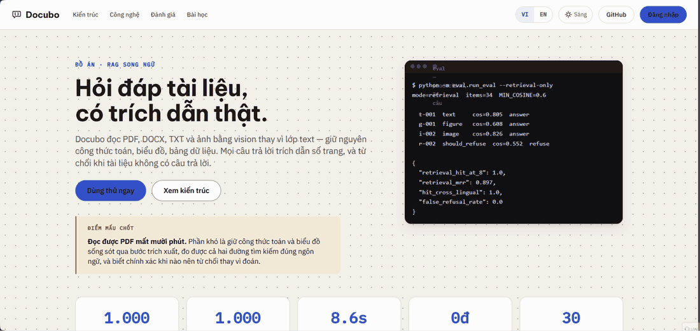

# Docubo

Trợ lí hỏi đáp **tài liệu do bạn tải lên**, song ngữ Việt – Anh. Đọc được công
thức toán và biểu đồ, mọi câu trả lời đều trích dẫn số trang — và **từ chối trả
lời** khi tài liệu không chứa câu trả lời.

> Đồ án cuối kì thực tập AI Engineer. Toàn bộ hạ tầng chạy trên free tier,
> chi phí 0 đồng.

[](https://github.com/trantiendat0611/Docubo/actions/workflows/ci.yml)

**Live demo:** https://docubo.vercel.app

 *(thêm ở tuần 8)*

---

## Vấn đề

Thư viện parse PDF thông thường phá huỷ đúng phần khó nhất của tài liệu kĩ
thuật. Công thức toán là các glyph đặt theo toạ độ, trích ra thành chuỗi rác;
biểu đồ trích ra thành chuỗi rỗng. Một hệ RAG dựng trên nền đó sẽ trả lời tự
tin về những nội dung nó chưa từng đọc được.

## Bốn quyết định thiết kế

**Ingest bằng vision.** Mỗi trang được render thành ảnh rồi đưa qua Gemini để
lấy Markdown + LaTeX + mô tả biểu đồ, thay vì parse lớp text.

**Mỗi chunk mang hai biểu diễn.** `embed_text` là văn xuôi thuần — công thức đã
diễn giải thành lời, biểu đồ đã mô tả thành lời — dùng để tìm kiếm.
`display_text` giữ nguyên LaTeX, dùng để hiển thị và làm context cho LLM. Chuỗi
LaTeX thô lập chỉ mục toàn văn ra token rác — `\langle` thành `langl` — nên
nhánh tìm kiếm theo từ khoá không khớp được câu hỏi nào. Đo ở
`SKILL_MY_PROJECT.md` §1.2.

**Truy hồi hybrid ba nhánh.** Vector đa ngữ bắt được ngữ nghĩa xuyên ngôn ngữ,
nhưng full-text thì không: Postgres có từ điển tiếng Anh mà không có tiếng Việt.
Hệ thống giữ hai cột `tsvector` riêng, sinh biến thể truy vấn cho cả hai ngôn
ngữ trong cùng một lần gọi model, rồi hợp nhất ba danh sách bằng RRF.

**Trình duyệt render PDF, không phải server.** Render phía server cần native
canvas binding — thứ hạ tầng serverless xử lí tệ nhất — và đặt phần chậm nhất
của ingest vào trong hàm 60 giây. Trình duyệt đã có sẵn canvas và đã có sẵn file.

## Cô lập dữ liệu

Người dùng tự tải tài liệu lên, nên tài liệu của người này không được lọt vào
câu trả lời của người khác. Việc đó được đảm bảo **ở tầng database**, không phải
ở tầng ứng dụng:

| Đường | Client | RLS |
|---|---|---|
| Đọc, truy vấn | JWT người dùng | Có hiệu lực |
| Ghi khi ingest | `service_role` | Bỏ qua, tự đặt `owner_id` |

Hàm `hybrid_search` là `SECURITY INVOKER`, nên policy lọc chunk ngay trong
database. Route handler quên lọc theo chủ sở hữu sẽ trả về **rỗng**, không phải
tài liệu người khác.

Đã kiểm chứng bằng thực nghiệm: client ẩn danh và người dùng thứ hai đã đăng
nhập đều thấy 0 dòng ở cả bốn bảng.

## Kiến trúc

- [Sơ đồ tổng quan hệ thống](docs/architecture/01-high-level.mmd)
- [Sơ đồ luồng RAG pipeline](docs/architecture/02-rag-pipeline.mmd)

| Thành phần | Công nghệ |
|---|---|
| Frontend & API | Next.js 15 trên Vercel Hobby |
| Xác thực | Supabase Auth, email + mật khẩu |
| LLM | Gemini Flash (vision, phân tích truy vấn, sinh câu trả lời) |
| Embedding | Gemini Embedding, 768 chiều |
| Vector DB | Supabase Postgres + pgvector, index HNSW |
| Render PDF | `pdfjs-dist`, chạy trong trình duyệt |
| Ingest hàng loạt | Python + PyMuPDF, CLI nội bộ |
| CI | GitHub Actions — lint, typecheck, test, build |

## Cấu trúc thư mục

```
db/       7 migration SQL: schema, hybrid search, RLS, đa người dùng,
          page cache, document overview, hội thoại
docs/     kế hoạch, requirements, sơ đồ, SKILL_MY_PROJECT,
          báo cáo tiến độ gửi mentor, báo cáo đồ án (BAO_CAO.md)
src/      ứng dụng Next.js — UI, route ingest, route chat, thư viện ingest TS
ingest/   pipeline Python, dùng để nạp corpus lớn và sinh dữ liệu eval
eval/     bộ câu hỏi đánh giá, metrics, harness
data/     PDF nguồn, ảnh trang, cache JSON — gitignored
```

Hai pipeline ingest cùng tồn tại có chủ ý: bản TypeScript phục vụ người dùng
tải lên, bản Python phục vụ nạp hàng loạt và chạy eval. Chúng **bắt buộc phải
sinh ra chunk giống hệt nhau** — có một parity test so từng byte, chạy bằng
`npx vitest run parity`.

## Chạy tại máy

**1. Chuẩn bị khoá**

```bash
cp .env.example .env
```

Điền `GEMINI_API_KEY` (lấy ở [aistudio.google.com](https://aistudio.google.com)),
`SUPABASE_URL`, `SUPABASE_SERVICE_KEY`, `NEXT_PUBLIC_SUPABASE_URL`,
`NEXT_PUBLIC_SUPABASE_ANON_KEY`.

**2. Dựng cơ sở dữ liệu**

Chạy 7 file trong `db/` theo đúng thứ tự số, trong Supabase SQL Editor.

Rồi tắt xác nhận email: Authentication → Sign In / Providers → Email →
tắt **Confirm email**. Free tier không có SMTP nên bật nó sẽ chặn việc đăng ký.

**3. Cài phụ thuộc**

```bash
npm install
```

Python (chỉ cần nếu dùng CLI nạp hàng loạt) — tạo môi trường ảo riêng:

```bash
python -m venv .venv
```

```bash
.venv/Scripts/python -m pip install -r ingest/requirements.txt
```

**4. Chạy**

```bash
npm run dev
```

Đăng ký tài khoản, tải lên một PDF ≤ 25 trang, đợi xử lí xong rồi hỏi.
**Giữ tab hiển thị** trong lúc xử lí — trình duyệt đình chỉ việc vẽ trang ở tab
nền, và pdfjs sẽ dừng theo.

## CLI nạp hàng loạt

Dùng khi cần nạp corpus lớn hơn giới hạn 25 trang của giao diện, hoặc để chuẩn
bị dữ liệu cho eval.

```bash
.venv/Scripts/python -m ingest.main models
```

```bash
.venv/Scripts/python -m ingest.main check-db
```

```bash
.venv/Scripts/python -m ingest.main spike data/raw/tai-lieu.pdf --pages 12,31,44
```

`spike` đọc vài trang khó nhất và in kết quả ra để người đọc tự đánh giá, không
đụng database. Chạy nó trước khi nạp cả tài liệu.

```bash
.venv/Scripts/python -m ingest.main all data/raw/tai-lieu.pdf --title "Tên tài liệu"
```

```bash
.venv/Scripts/python -m ingest.main query "câu hỏi thử"
```

Giai đoạn vision cache từng trang ra `data/cache/`. Lần chạy sau chỉ xử lí trang
chưa có cache, nên chỉnh chunker hay đổi embedding model không tốn thêm quota.

Nhớ đặt `INGEST_OWNER_ID` trong `.env`, nếu không tài liệu sẽ nạp thành công
nhưng RLS ẩn nó khỏi mọi người dùng.

## Kiểm thử

```bash
npm test
```

```bash
.venv/Scripts/python -m pytest ingest/tests eval/tests -q
```

Test chạy thật với Gemini và Supabase bị bỏ qua trừ khi bật cờ:

```bash
$env:RUN_LIVE=1
```

```bash
npx vitest run live
```

## Đánh giá

```bash
.venv/Scripts/python -m eval.run_eval --retrieval-only
```

Bốn chỉ số, mỗi cái trả lời một câu hỏi khác nhau:

| Chỉ số | Đo cái gì |
|---|---|
| `retrieval_hit_at_8` | Trang đúng có được truy hồi không — tách riêng retriever khỏi generator |
| `citation_validity` | Marker `[n]` có trỏ đúng block được cấp không |
| `faithfulness` | Mọi khẳng định có nằm trong context không |
| `refusal_rate` | Có từ chối đúng lúc khi tài liệu không chứa câu trả lời không |

`faithfulness` cần chế độ full (gọi `/api/chat` thật) và cờ `--judge`, vì nó
chấm bằng Gemini làm giám khảo trên chính context đã sinh ra câu trả lời —
tốn thêm một lượt gọi model cho mỗi câu đã trả lời:

```bash
.venv/Scripts/python -m eval.run_eval --judge --token $env:EVAL_ACCESS_TOKEN
```

## Triển khai

Chạy trên Vercel Hobby, region **Singapore (`sin1`)** — cùng khu vực với
Supabase. Mặc định của Vercel là Washington D.C., và mỗi câu hỏi thực hiện
khoảng ba vòng gọi database, nên chọn sai region cộng thêm gần một giây thuần
độ trễ mạng. Đo trên cùng một request: 0.76s trước khi đổi, 0.34s sau.

Chỉ bật environment **Production**. Không có Supabase project riêng cho preview,
nên một bản deploy xem trước sẽ ghi vào cùng database và tiêu cùng hạn mức
ngày với production. Đó là hệ quả trực tiếp của ràng buộc 0 đồng.

## Giới hạn đã biết

**Quota là ràng buộc thật, không phải dung lượng.** Free tier cấp khoảng 20
request vision mỗi ngày **cho mỗi model**. Gộp 8 trang một request và xoay vòng
4 model được khoảng 640 trang/ngày — dùng chung cho toàn bộ người dùng. Vì vậy
mỗi tài liệu giới hạn 25 trang và mỗi người 5 lượt tải/ngày.

**Hạn mức là của cả ứng dụng, không phải của từng người.** Vài người dùng thật
là hết ngày, và app ngừng trả lời cho tất cả. Ai cũng đăng ký được vì free tier
không có SMTP để xác nhận email, nên link công khai là link ai có cũng vào được.

**Supabase free tạm dừng sau 7 ngày không hoạt động.** `/api/health` truy vấn
Postgres một lần và trả `{ ok, database, ms }` — không gọi model. GitHub Action
`Keep-alive` gọi nó thứ Hai và thứ Năm, nên khoảng lặng dài nhất là 4 ngày.

- Chỉ hỗ trợ PDF. DOCX/TXT nằm ở P1.
- Không OCR tài liệu scan.
- Full-text tiếng Việt dùng config `simple`, không stem được.
- Chuyển tab khi đang xử lí sẽ tạm dừng việc đọc trang.
- Một số trang bị Gemini từ chối đọc vì `RECITATION`; chain model xử lí được
  phần lớn nhưng không phải tất cả.
- **Chất lượng và tốc độ phụ thuộc thời điểm trong ngày.** Khi các model mạnh
  cạn hạn mức, chain rơi xuống `gemini-3.5-flash-lite`. Model này **nhanh hơn**
  (token đầu tiên 2.9–4.2s so với 8.4s) nhưng là model duy nhất từng **bỏ marker
  trích dẫn**: cộng dồn bốn lần chạy đầy đủ, model mạnh 41/41 câu có trích dẫn,
  `flash-lite` 31/33. Hai thứ này đánh đổi nhau, nên một lần đo tốc độ đẹp
  thường là một lần đo ở chế độ chất lượng thấp.
- Khi Gemini chậm bất thường, câu hỏi bị dừng ở **50 giây** kèm thông báo rõ
  thay vì chạm trần 60 giây của hàm Vercel và trả về lỗi client không đọc được
  (đã đo 2/26 câu ở lần chạy 19/08 trước khi sửa).

## Nguồn tài liệu

*(Liệt kê tài liệu dùng để thử nghiệm và đánh giá, kèm giấy phép. File PDF gốc
không được commit.)*
