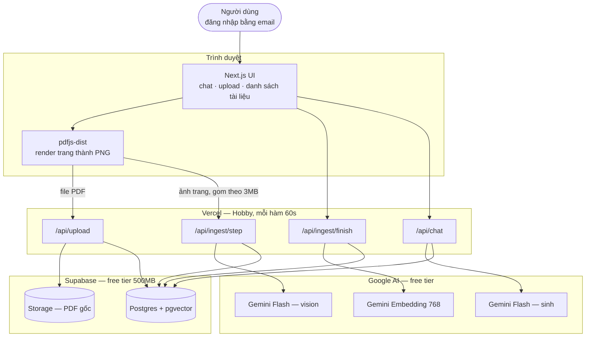
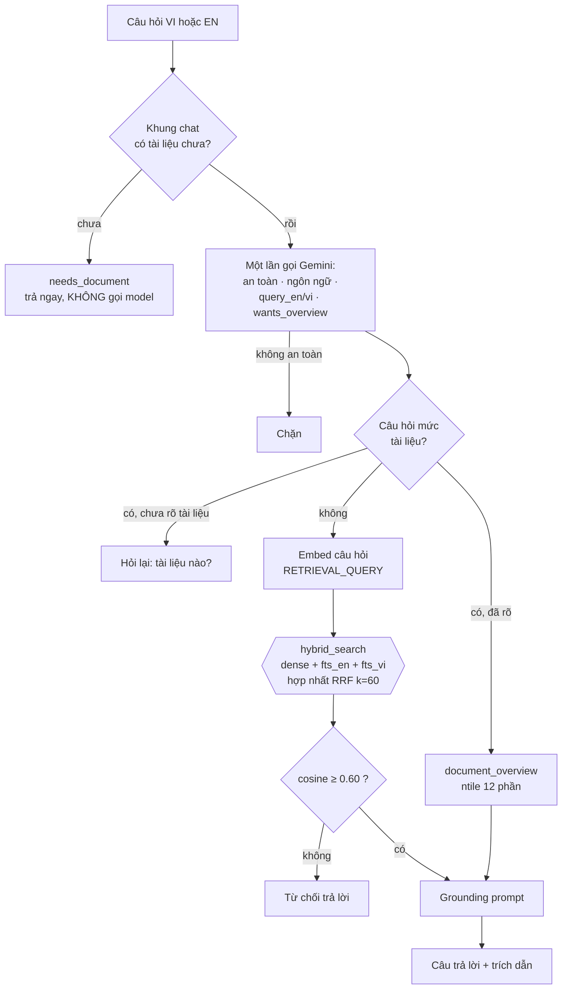

# BÁO CÁO ĐỒ ÁN THỰC TẬP

## Docubo — Trợ lí hỏi đáp tài liệu song ngữ trên nền RAG

> Thực tập sinh AI Engineer · 03/08/2026 – 27/09/2026
> Mã nguồn: https://github.com/trantiendat0611/Docubo
> Bản chạy thật: https://docubo.vercel.app
>
> *Chương 1–2 viết ngày 19/08. Trạng thái các chương còn lại ở cuối tài liệu.*

---

# Chương 1 — Tổng quan

## 1.1 Bối cảnh

Tài liệu kĩ thuật — giáo trình, bài báo, slide bài giảng — là dạng nội dung
người học phải đọc kĩ nhất và cũng là dạng khó tra cứu nhất. Một cuốn giáo trình
machine learning 300 trang chứa câu trả lời cho hầu hết câu hỏi của người mới,
nhưng tìm ra nó đòi hỏi đã biết nó nằm ở đâu.

Cách giải hiển nhiên là dựng một hệ hỏi đáp trên tài liệu: trích văn bản khỏi
PDF, cắt thành đoạn, nhúng thành vector, tìm đoạn gần nhất với câu hỏi rồi để mô
hình ngôn ngữ trả lời dựa trên đó. Đây là kiến trúc RAG chuẩn và có sẵn thư viện
cho mọi bước.

**Vấn đề nằm ở bước đầu tiên.** Thư viện parse PDF thông thường phá huỷ đúng
phần khó nhất của tài liệu kĩ thuật. Đo trực tiếp trên trang 44 của tài liệu thử
nghiệm, bằng cả `pypdf` lẫn `pymupdf`:

| Hiện tượng | Bằng chứng | Hậu quả |
|---|---|---|
| Toán tử ∏ biến mất hoàn toàn | `"∏" in text` trả `False` ở cả hai thư viện | Công thức trích ra là một **phương trình khác**, và là phương trình sai |
| Phân số tách làm hai dòng | `= 1` xuống dòng rồi `Z` | `1/Z` thành "1" và "Z" rời nhau |
| Chỉ số dưới bị làm phẳng | `pa_k` thành `pak` | `pak` là token không tồn tại trong bất kì câu hỏi nào |
| Biến mã bằng Unicode math-italic | `𝑝` là U+1D45D, không phải `p` U+0070 | Người dùng gõ `p(x)` không khớp `𝑝(𝑥)` |
| Biểu đồ | 2 trong 3 hình ở trang 31 trích ra **0 kí tự** | Nội dung chỉ nằm trong hình là nội dung biến mất |

Điều nguy hiểm nhất không phải chuỗi rác — mà là **văn xuôi quanh công thức vẫn
sạch**. Một hệ RAG dựng trên nền này trông vẫn chạy tốt: nó trả lời trôi chảy
các câu hỏi về phần chữ, và trả lời tự tin về những công thức nó chưa từng đọc
được. Lỗi không biểu hiện thành lỗi.

## 1.2 Mục tiêu

Docubo là trợ lí hỏi đáp trên **tài liệu do chính người dùng tải lên**, với bốn
tính chất bắt buộc:

1. **Đọc được công thức và biểu đồ**, không chỉ phần văn xuôi.
2. **Song ngữ Việt – Anh**, cụ thể là hỏi tiếng Việt trên tài liệu tiếng Anh.
3. **Mọi câu trả lời có trích dẫn số trang**, kiểm chứng ngược được.
4. **Từ chối trả lời** khi tài liệu không chứa câu trả lời.

Tính chất thứ tư đáng bảo vệ nhất và cũng dễ bị hi sinh nhất. Không hệ RAG nào
trả lời đúng mọi câu hỏi. Một hệ thống nói *"tài liệu không có thông tin này"*
đáng tin hơn hẳn một hệ thống trả lời trơn tru mọi thứ — vì với hệ thứ hai,
người dùng không có cách nào biết câu nào đáng tin.

## 1.3 Phạm vi

**Trong phạm vi (P0, đã hoàn thành):** đăng nhập, tải PDF tối đa 25 trang, trích
xuất bằng vision, nhiều khung hội thoại với tài liệu gắn theo từng khung, truy
hồi hybrid ba nhánh, trả lời có trích dẫn, từ chối theo ngưỡng, cô lập dữ liệu
giữa người dùng, và một bộ đánh giá 26 câu chạy được trên bản production.

**Ngoài phạm vi, có chủ ý:**

| Bỏ | Lí do |
|---|---|
| OCR tài liệu scan | Chất lượng phụ thuộc bản scan, không kiểm soát được |
| Fine-tuning | Không có ngân sách, và RAG đã giải quyết bài toán |
| Agent / multi-hop | Vượt phạm vi MVP 8 tuần |
| Render PDF phía server | Cần native canvas binding — thứ hạ tầng serverless xử lí tệ nhất |
| Xác nhận email khi đăng ký | Free tier không có SMTP; bật lại chỉ là một công tắc khi triển khai thật |

Danh sách này được ghi từ đầu, không phải giải thích về sau. Một phạm vi không
có ranh giới rõ là một phạm vi sẽ tự nở ra cho đến khi hết thời gian.

## 1.4 Ràng buộc quyết định mọi thứ còn lại

Đề bài yêu cầu **chi phí 0 đồng**. Đây không phải ràng buộc phụ mà là ràng buộc
sinh ra gần như toàn bộ thiết kế còn lại.

Free tier của Google AI cấp khoảng **20 request sinh nội dung mỗi ngày cho mỗi
model** — không phải 15 request mỗi phút như tài liệu chính thức mô tả (đó là
hạn mức của một model đã ngừng phục vụ). Hệ quả dây chuyền:

```
20 request/ngày/model
  → xoay vòng chain 4 model              ≈ 80 request/ngày
  → gộp 8 trang ảnh mỗi request          ≈ 640 trang/ngày
  → chia cho toàn bộ người dùng          → 25 trang mỗi tài liệu
                                         → 5 lượt tải mỗi người mỗi ngày
```

Nghĩa là **giới hạn 25 trang không phải giới hạn dung lượng**. Nó là hệ quả số
học của hạn mức ngày. Tương tự, hạn mức là của **cả ứng dụng** chứ không phải
của từng người — vài người dùng thật sự là hết ngày, và ứng dụng ngừng trả lời
cho tất cả.

Ràng buộc này cũng định hình cách làm việc: mọi phản hồi tốn quota đều được cache
ra đĩa ngay từ tuần đầu, và mọi phép đo phải tính trước ngân sách request trước
khi bấm chạy.

## 1.5 Cấu trúc báo cáo

| Chương | Nội dung |
|---|---|
| 1 | Bối cảnh, mục tiêu, phạm vi, ràng buộc |
| 2 | Phân tích yêu cầu và thiết kế hệ thống |
| 3 | Triển khai kĩ thuật và những bẫy đã gặp |
| 4 | Kết quả đánh giá bằng số đo |
| 5 | Kết luận và hướng phát triển |

---

# Chương 2 — Phân tích và Thiết kế

## 2.1 Người dùng và hai giả định định hình thiết kế

| Nhóm | Nhu cầu | Ngôn ngữ hỏi |
|---|---|---|
| Sinh viên / người tự học | Tra cứu khái niệm, hiểu công thức | Tiếng Việt |
| Kĩ sư đọc paper | Tìm nhanh định nghĩa, tóm tắt bài báo | Cả hai |

**Giả định 1 — người dùng hỏi tiếng Việt trên tài liệu tiếng Anh.** Đây là ca
chính, không phải ca biên. Nó quyết định toàn bộ thiết kế truy hồi ở §2.5.

**Giả định 2 — tài liệu của mỗi người là riêng tư.** Người A không được thấy tài
liệu người B trong bất kì câu trả lời nào. Điều này quyết định thiết kế ở §2.7.

Cả hai được ghi ra trước khi viết dòng code nào, và cả hai đều được kiểm chứng
lại bằng đo đạc ở chương 4 chứ không để nguyên là giả định.

## 2.2 Yêu cầu chức năng

Yêu cầu chia thành P0 (bắt buộc) và P1 (làm nếu còn thời gian). Toàn bộ P0 đã
hoàn thành. Danh sách đầy đủ ở `docs/REQUIREMENTS.md` §3; dưới đây là các nhóm.

**Tải lên và xử lí** — đăng nhập email/mật khẩu; tải PDF tối đa 25 trang; trình
duyệt render từng trang và gửi theo lô; trích xuất bằng vision (văn bản + LaTeX
+ mô tả biểu đồ); hiện tiến độ thật theo số trang server đã xử lí; xem và xoá
tài liệu của mình.

**Hội thoại** — nhiều khung chat, mỗi khung có lịch sử riêng lưu trong database;
tài liệu gắn vào khung đang mở và câu hỏi chỉ được trả lời từ tài liệu của khung
đó; một tài liệu dùng lại được ở nhiều khung mà không phải nạp lại; hội thoại
nhiều lượt với 3 lượt gần nhất làm ngữ cảnh.

**Truy hồi và trả lời** — chunk mang hai biểu diễn; truy hồi hybrid ba nhánh hợp
nhất bằng RRF; giới hạn phạm vi theo tài liệu; nhánh riêng cho câu hỏi mức tài
liệu; trích dẫn số trang; từ chối dưới ngưỡng; hiển thị KaTeX và phản hồi dạng
stream; trả lời đúng ngôn ngữ người hỏi.

**An toàn** — chặn prompt injection ở đầu vào; cô lập dữ liệu ở tầng database;
giới hạn 5 lượt tải mỗi người mỗi ngày.

## 2.3 Yêu cầu phi chức năng

| Tiêu chí | Mục tiêu | Trạng thái |
|---|---|---|
| Chi phí | 0 đồng | Đạt — toàn bộ hạ tầng chạy trên free tier |
| Thời gian tới token đầu tiên | < 3s | Đạt — đo trên production 2889ms |
| Quota vision | ~20 request/ngày/model | Ràng buộc, không phải mục tiêu |
| Giới hạn tài liệu | 25 trang | Hệ quả của quota |
| Body mỗi request | ≤ 3MB | Vercel Hobby chặn khoảng 4.5MB |
| Dung lượng | Supabase 500MB | Đang dùng dưới 1MB |

Ngưỡng "token đầu tiên dưới 3s" đáng nói riêng, vì nó là ví dụ cho một sai lầm
đo đạc được ghi lại ở chương 3: harness ban đầu đo **tổng thời gian đọc hết câu
trả lời** rồi báo cáo nó như thời gian tới token đầu tiên. Hai đại lượng này
cách nhau vài giây. Ngưỡng chỉ thật sự được kiểm chứng sau khi harness biết đọc
stream theo từng đoạn.

## 2.4 Kiến trúc tổng thể

Ba khối chạy trên ba dịch vụ free tier khác nhau, nối với nhau bằng HTTP.



*(Sơ đồ đầy đủ, có middleware và toàn bộ bảng: `docs/architecture/01-high-level.mmd`)*

**Quyết định đáng giải thích nhất: trình duyệt render PDF, không phải server.**
Render phía server cần native canvas binding — thứ hạ tầng serverless xử lí tệ
nhất — và đặt phần chậm nhất của ingest vào bên trong một hàm giới hạn 60 giây.
Trình duyệt thì đã có sẵn canvas và đã có sẵn file trong tay người dùng.

Hệ quả kéo theo: ingest **không thể** là một request duy nhất. Một tài liệu 25
trang mất vài phút, vượt xa giới hạn hàm. Nên nó được chia thành chuỗi bước ngắn
— `/api/upload` tạo job, `/api/ingest/step` xử lí từng lô trang,
`/api/ingest/finish` chunk và embed — với bảng `ingest_jobs` giữ trạng thái, để
việc này resume được và để thanh tiến độ có một nguồn sự thật duy nhất.

## 2.5 Thiết kế truy hồi

Đây là phần kĩ thuật nhất của thiết kế, và là nơi ba quyết định quan trọng nhất
nằm.



*(Sơ đồ đầy đủ: `docs/architecture/02-rag-pipeline.mmd`)*

### 2.5.1 Mỗi chunk mang hai biểu diễn

Mỗi đoạn được lưu hai lần dưới hai dạng:

- `embed_text` — văn xuôi thuần: công thức đã diễn giải thành lời, biểu đồ đã mô
  tả thành lời. Dùng để **tìm kiếm**.
- `display_text` — giữ nguyên LaTeX và markdown. Dùng để **hiển thị** và làm ngữ
  cảnh cho mô hình sinh.

Lí lẽ ban đầu cho quyết định này là "chuỗi LaTeX embed ra vector gần như vô
nghĩa". Khi đo thì lí lẽ đó **sai**: chênh lệch cosine giữa hai biểu diễn trên
cùng một câu hỏi thật chỉ 0.004–0.031, và có ca LaTeX còn nhỉnh hơn. Mô hình
embedding đa ngữ xử lí kí hiệu toán tốt hơn dự đoán ban đầu.

Thứ LaTeX thật sự phá là **chỉ mục toàn văn**. `to_tsvector` cắt gốc chuỗi
`\langle` thành token `langl` và `\rangle` thành `rangl` — những token không
xuất hiện trong câu hỏi của bất kì người nào. Một chunk lập chỉ mục từ LaTeX thô
khớp **0 token** với câu hỏi "inner product là gì". Quyết định thiết kế đúng, lí
do ban đầu sai; cả hai được ghi lại trong `SKILL_MY_PROJECT.md` §1.2.

### 2.5.2 Truy hồi hybrid ba nhánh

Vector đa ngữ bắt được ngữ nghĩa xuyên ngôn ngữ, nhưng full-text thì không —
full-text khớp **token theo mặt chữ**, nên câu hỏi tiếng Việt không có token nào
trùng với đoạn văn tiếng Anh. Đây là hạn chế khác với việc Postgres không có từ
điển tiếng Việt (khiến `fts_vi` phải dùng config `simple`, không stem được).

Hệ thống vì thế giữ ba nhánh song song — `embedding` (HNSW, cosine), `fts_en`,
`fts_vi` — và sinh sẵn cả `query_en` lẫn `query_vi` ngay trong lần gọi guardrail
đã bắt buộc phải thực hiện. Nhánh thứ ba không tốn thêm lượt gọi model nào.

Ba danh sách được hợp nhất bằng **RRF** (`1/(60 + rank)`) thay vì cộng điểm có
trọng số. Lí do: điểm cosine và điểm `ts_rank` không cùng thang đo và không có
cách chuẩn hoá nào đúng cho mọi truy vấn. RRF chỉ dùng **thứ hạng**, nên vấn đề
đó biến mất.

### 2.5.3 Câu hỏi mức tài liệu đi đường riêng

"Tóm tắt tài liệu này" không phải một câu hỏi truy hồi: không đoạn nào trong tài
liệu mang nghĩa "toàn bộ tài liệu". Tìm kiếm tương đồng vì thế trả về đoạn na ná
chủ đề — đã quan sát thấy ở mức cosine 0.64, vừa đủ vượt ngưỡng từ chối 0.60, và
lấy từ **một tài liệu khác**.

Nhánh `document_overview` chia tài liệu bằng `ntile` thành 12 phần và lấy chunk
trải đều theo thứ tự đọc. Nếu câu hỏi chưa nêu rõ tài liệu nào thì hệ thống hỏi
lại kèm danh sách, không đoán.

## 2.6 Thiết kế dữ liệu

Bảy migration, mỗi cái là một quyết định tách bạch:

| File | Nội dung |
|---|---|
| `001_schema.sql` | `documents`, `chunks` (hai biểu diễn, vector 768, hai cột `tsvector`), `query_log` |
| `002_hybrid_search.sql` | Hàm `hybrid_search` — ba nhánh, hợp nhất RRF, chạy trong database |
| `003_security.sql` | Bật row-level security |
| `004_multi_tenant.sql` | `owner_id` trên mọi bảng, `ingest_jobs`, policy theo chủ sở hữu |
| `005_ingest_pages.sql` | `document_pages` (cache trang), bucket Storage riêng tư |
| `006_document_overview.sql` | Hàm lấy chunk trải đều bằng `ntile` |
| `007_conversations.sql` | `conversations`, `conversation_documents`, `messages` |

Hai chi tiết thiết kế đáng nêu:

**Hợp nhất RRF chạy trong database, không phải trong ứng dụng.** Ba nhánh trả về
cùng một tập chunk; kéo cả ba lên tầng ứng dụng rồi mới hợp nhất nghĩa là chuyển
ba lần dữ liệu qua mạng để rồi bỏ đi phần lớn.

**`content_hash` unique theo từng chủ sở hữu, không toàn cục.** Ban đầu nó unique
toàn cục để khỏi nạp lại cùng một tài liệu hai lần. Nhưng khi có nhiều người
dùng, điều đó nghĩa là người thứ hai tải lên đúng file người thứ nhất đã có sẽ bị
từ chối — và tệ hơn, sẽ dùng chung bản ghi của người khác. Migration 007 đổi
thành unique trên `(owner_id, content_hash)`.

## 2.7 Cô lập dữ liệu

Người dùng tự tải tài liệu lên, nên tài liệu người này không được lọt vào câu
trả lời của người khác. Việc đó được đảm bảo **ở tầng database**, không phải ở
tầng ứng dụng:

| Đường | Client | RLS |
|---|---|---|
| Đọc, truy vấn | JWT người dùng | Có hiệu lực |
| Ghi khi ingest | `service_role` | Bỏ qua, tự đặt `owner_id` |

Hàm `hybrid_search` khai báo `SECURITY INVOKER`, nên policy lọc chunk ngay bên
trong database. Điểm mấu chốt: **một route handler quên lọc theo chủ sở hữu sẽ
trả về rỗng, không phải trả về tài liệu người khác.** Lỗi nghiêm trọng nhất có
thể xảy ra bị biến thành lỗi vô hại nhất.

Đã kiểm chứng bằng thực nghiệm: client ẩn danh và người dùng thứ hai đã đăng
nhập đều thấy 0 dòng ở cả bốn bảng.

## 2.8 Trường hợp ngoại lệ

Thiết kế liệt kê **26 trường hợp ngoại lệ** kèm cách xử lí và vị trí trong mã
nguồn (`docs/REQUIREMENTS.md` §5). Chúng không phải danh sách viết cho đủ — phần
lớn được thêm vào **sau khi gặp thật**. Vài ca tiêu biểu:

| # | Tình huống | Xử lí |
|---|---|---|
| E3 | Prompt injection **nằm trong tài liệu** | System prompt coi context là dữ liệu, không phải chỉ thị |
| E13 | Model từ chối đọc trang vì `RECITATION` | Thử lại primary, rồi xoay sang model thế hệ khác |
| E16 | Cạn quota ngày giữa lúc ingest | Xoay model; hết cả chain thì báo rõ, trang đã đọc vẫn giữ |
| E17 | Người dùng chuyển tab khi đang upload | Trình duyệt đình chỉ `requestAnimationFrame` nên render treo — timeout 45s kèm giải thích |
| E21 | Truy cập tài liệu người khác | RLS chặn ở database, không phải ở code |
| E24 | Gửi `conversationId` của người khác | RLS trả rỗng nên route trả 404, không lộ sự tồn tại |

## 2.9 Tổng kết bốn quyết định thiết kế

| Quyết định | Thay cho | Lí do |
|---|---|---|
| Ingest bằng vision | Parse lớp text | Lớp text phá công thức và bỏ trắng biểu đồ (§1.1) |
| Hai biểu diễn mỗi chunk | Một trường text duy nhất | LaTeX thô phá chỉ mục toàn văn (§2.5.1) |
| Hybrid ba nhánh + RRF | Chỉ vector | Full-text không vượt được ngôn ngữ (§2.5.2) |
| Trình duyệt render PDF | Render phía server | Serverless không có canvas, và hàm chỉ có 60 giây (§2.4) |

Cả bốn đều được kiểm chứng bằng số đo chứ không dừng ở lí lẽ — và một trong bốn
lí lẽ đã bị chính phép đo bác bỏ rồi phải viết lại. Chi tiết ở chương 4.

---

## Trạng thái tài liệu

| Chương | Trạng thái | Nguyên liệu |
|---|---|---|
| 1. Tổng quan | **Xong** 19/08 | `REQUIREMENTS.md` §1–2, `SKILL_MY_PROJECT.md` §1.1 |
| 2. Phân tích & Thiết kế | **Xong** 19/08 | `REQUIREMENTS.md` §3–6, 2 sơ đồ, `SKILL` §1.2–1.3 |
| 3. Triển khai kĩ thuật | Tuần 6 | `SKILL` §2 (8 bước), §3 (19 bẫy) |
| 4. Kết quả đánh giá | Tuần 6 | `SKILL` §4, `eval/reports/*.json` |
| 5. Kết luận | Tuần 7 | `SKILL` §5 |

**Việc còn lại của chương 1–2:** hai sơ đồ mermaid cần xuất ra PNG trước khi
chuyển báo cáo sang `.docx` — pandoc không render mermaid. Đã ghi vào việc tuần 8.
