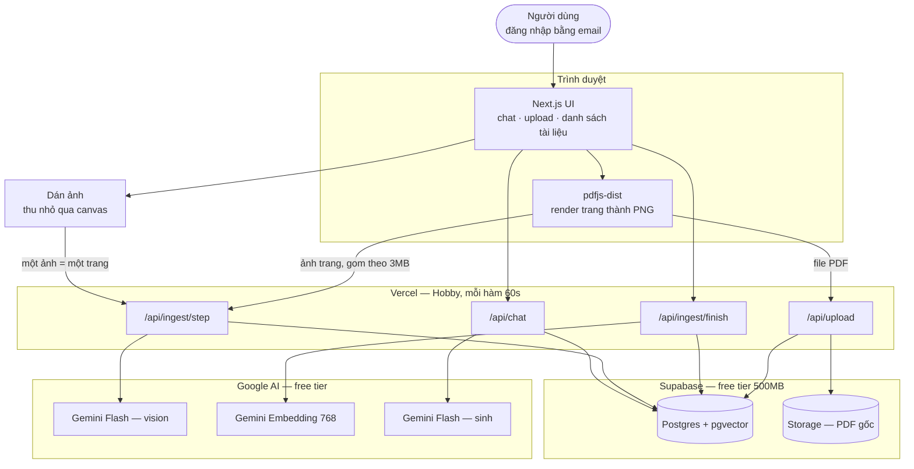
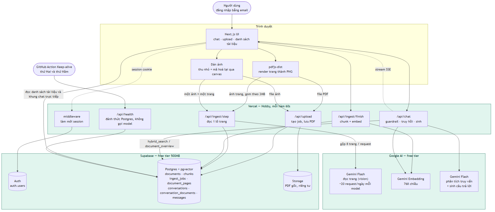
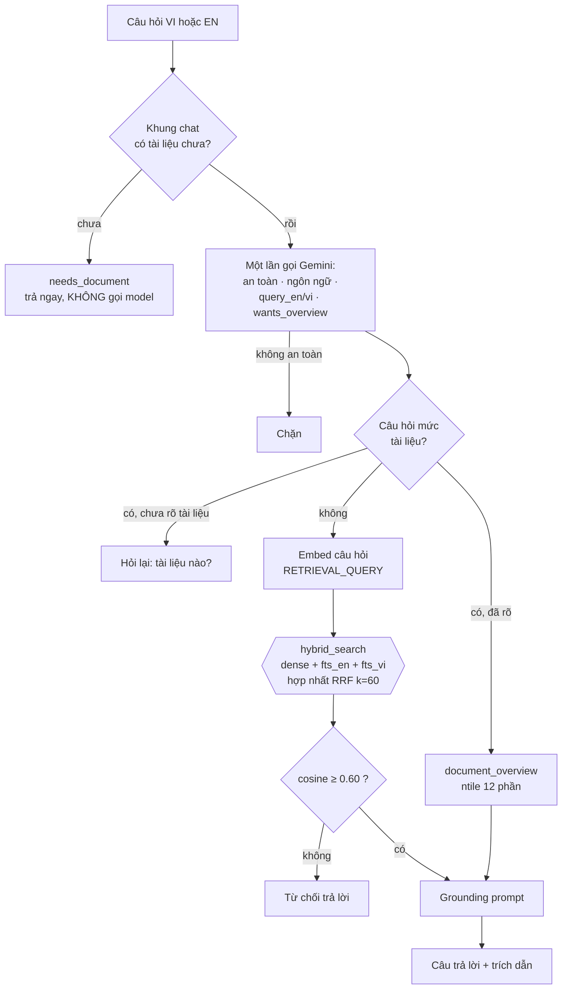
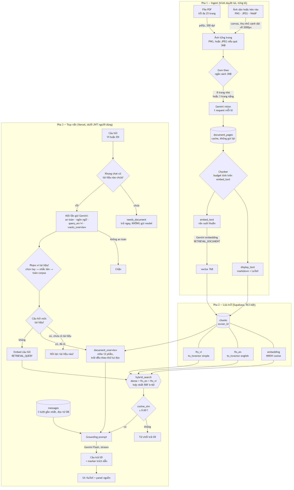

# BÁO CÁO ĐỒ ÁN THỰC TẬP

## Docubo — Trợ lí hỏi đáp tài liệu song ngữ trên nền RAG

> Thực tập sinh AI Engineer · 03/08/2026 – 27/09/2026
> Mã nguồn: https://github.com/trantiendat0611/Docubo
> Bản chạy thật: https://docubo.vercel.app
>
> *Chương 1–2 viết 19/08, chương 3–4 cùng ngày, chương 5 ngày 21/08.
> Số liệu cập nhật tới lần chạy production 21/08.*

---

# Chương 1 — Tổng quan

## 1.1 Bối cảnh

Tài liệu kĩ thuật — giáo trình, bài báo, slide bài giảng — là dạng nội dung
người học phải đọc kĩ nhất và cũng là dạng khó tra cứu nhất. Một cuốn giáo trình
machine learning 300 trang chứa câu trả lời cho hầu hết câu hỏi của người mới,
nhưng tìm ra nó đòi hỏi đã biết nó nằm ở đâu.

Cách giải hiển nhiên là dựng một hệ hỏi đáp trên tài liệu: trích văn bản khỏi
PDF, cắt thành đoạn, nhúng thành vector, tìm đoạn gần nhất với câu hỏi rồi để mô
hình ngôn ngữ trả lời dựa trên đó. Đây là kiến trúc RAG chuẩn và có sẵn thư viện
cho mọi bước.

**Vấn đề nằm ở bước đầu tiên.** Thư viện parse PDF thông thường phá huỷ đúng
phần khó nhất của tài liệu kĩ thuật. Đo trực tiếp trên trang 44 của tài liệu thử
nghiệm, bằng cả `pypdf` lẫn `pymupdf`:

| Hiện tượng | Bằng chứng | Hậu quả |
|---|---|---|
| Toán tử ∏ biến mất hoàn toàn | `"∏" in text` trả `False` ở cả hai thư viện | Công thức trích ra là một **phương trình khác**, và là phương trình sai |
| Phân số tách làm hai dòng | `= 1` xuống dòng rồi `Z` | `1/Z` thành "1" và "Z" rời nhau |
| Chỉ số dưới bị làm phẳng | `pa_k` thành `pak` | `pak` là token không tồn tại trong bất kì câu hỏi nào |
| Biến mã bằng Unicode math-italic | `𝑝` là U+1D45D, không phải `p` U+0070 | Người dùng gõ `p(x)` không khớp `𝑝(𝑥)` |
| Biểu đồ | 2 trong 3 hình ở trang 31 trích ra **0 kí tự** | Nội dung chỉ nằm trong hình là nội dung biến mất |

Điều nguy hiểm nhất không phải chuỗi rác — mà là **văn xuôi quanh công thức vẫn
sạch**. Một hệ RAG dựng trên nền này trông vẫn chạy tốt: nó trả lời trôi chảy
các câu hỏi về phần chữ, và trả lời tự tin về những công thức nó chưa từng đọc
được. Lỗi không biểu hiện thành lỗi.

## 1.2 Mục tiêu

Docubo là trợ lí hỏi đáp trên **tài liệu do chính người dùng tải lên**, với bốn
tính chất bắt buộc:

1. **Đọc được công thức và biểu đồ**, không chỉ phần văn xuôi.
2. **Song ngữ Việt – Anh**, cụ thể là hỏi tiếng Việt trên tài liệu tiếng Anh.
3. **Mọi câu trả lời có trích dẫn số trang**, kiểm chứng ngược được.
4. **Từ chối trả lời** khi tài liệu không chứa câu trả lời.

Tính chất thứ tư đáng bảo vệ nhất và cũng dễ bị hi sinh nhất. Không hệ RAG nào
trả lời đúng mọi câu hỏi. Một hệ thống nói *"tài liệu không có thông tin này"*
đáng tin hơn hẳn một hệ thống trả lời trơn tru mọi thứ — vì với hệ thứ hai,
người dùng không có cách nào biết câu nào đáng tin.

## 1.3 Phạm vi

**Trong phạm vi (P0, đã hoàn thành):** đăng nhập, tải PDF tối đa 25 trang, trích
xuất bằng vision, nhiều khung hội thoại với tài liệu gắn theo từng khung, truy
hồi hybrid ba nhánh, trả lời có trích dẫn, từ chối theo ngưỡng, cô lập dữ liệu
giữa người dùng, và một bộ đánh giá 31 câu chạy được trên bản production.

**Ngoài phạm vi, có chủ ý:**

| Bỏ | Lí do |
|---|---|
| OCR tài liệu scan | Chất lượng phụ thuộc bản scan, không kiểm soát được |
| Fine-tuning | Không có ngân sách, và RAG đã giải quyết bài toán |
| Agent / multi-hop | Vượt phạm vi MVP 8 tuần |
| Nạp DOCX / TXT | Không có số trang nên phải đổi đơn vị trích dẫn; và không đi qua đường vision, tức không dùng tới phần lõi của đồ án |
| Render PDF phía server | Cần native canvas binding — thứ hạ tầng serverless xử lí tệ nhất |
| Xác nhận email khi đăng ký | Free tier không có SMTP; bật lại chỉ là một công tắc khi triển khai thật |

Danh sách này được ghi từ đầu, không phải giải thích về sau. Một phạm vi không
có ranh giới rõ là một phạm vi sẽ tự nở ra cho đến khi hết thời gian.

## 1.4 Ràng buộc quyết định mọi thứ còn lại

Đề bài yêu cầu **chi phí 0 đồng**. Đây không phải ràng buộc phụ mà là ràng buộc
sinh ra gần như toàn bộ thiết kế còn lại.

Free tier của Google AI cấp khoảng **20 request sinh nội dung mỗi ngày cho mỗi
model** — không phải 15 request mỗi phút như tài liệu chính thức mô tả (đó là
hạn mức của một model đã ngừng phục vụ). Hệ quả dây chuyền:

```
20 request/ngày/model
  → xoay vòng chain 4 model              ≈ 80 request/ngày
  → gộp 8 trang ảnh mỗi request          ≈ 640 trang/ngày
  → chia cho toàn bộ người dùng          → 25 trang mỗi tài liệu
                                         → 5 lượt tải mỗi người mỗi ngày
```

Nghĩa là **giới hạn 25 trang không phải giới hạn dung lượng**. Nó là hệ quả số
học của hạn mức ngày. Tương tự, hạn mức là của **cả ứng dụng** chứ không phải
của từng người — vài người dùng thật sự là hết ngày, và ứng dụng ngừng trả lời
cho tất cả.

Ràng buộc này cũng định hình cách làm việc: mọi phản hồi tốn quota đều được cache
ra đĩa ngay từ tuần đầu, và mọi phép đo phải tính trước ngân sách request trước
khi bấm chạy.

## 1.5 Cấu trúc báo cáo

| Chương | Nội dung |
|---|---|
| 1 | Bối cảnh, mục tiêu, phạm vi, ràng buộc |
| 2 | Phân tích yêu cầu và thiết kế hệ thống |
| 3 | Triển khai kĩ thuật và những bẫy đã gặp |
| 4 | Kết quả đánh giá bằng số đo |
| 5 | Kết luận và hướng phát triển |

---

# Chương 2 — Phân tích và Thiết kế

## 2.1 Người dùng và hai giả định định hình thiết kế

| Nhóm | Nhu cầu | Ngôn ngữ hỏi |
|---|---|---|
| Sinh viên / người tự học | Tra cứu khái niệm, hiểu công thức | Tiếng Việt |
| Kĩ sư đọc paper | Tìm nhanh định nghĩa, tóm tắt bài báo | Cả hai |

**Giả định 1 — người dùng hỏi tiếng Việt trên tài liệu tiếng Anh.** Đây là ca
chính, không phải ca biên. Nó quyết định toàn bộ thiết kế truy hồi ở §2.5.

**Giả định 2 — tài liệu của mỗi người là riêng tư.** Người A không được thấy tài
liệu người B trong bất kì câu trả lời nào. Điều này quyết định thiết kế ở §2.7.

Cả hai được ghi ra trước khi viết dòng code nào, và cả hai đều được kiểm chứng
lại bằng đo đạc ở chương 4 chứ không để nguyên là giả định.

## 2.2 Yêu cầu chức năng

Yêu cầu chia thành P0 (bắt buộc) và P1 (làm nếu còn thời gian). Toàn bộ P0 đã
hoàn thành. Danh sách đầy đủ ở `docs/REQUIREMENTS.md` §3; dưới đây là các nhóm.

**Tải lên và xử lí** — đăng nhập email/mật khẩu; tải PDF tối đa 25 trang; **dán
hoặc kéo một ảnh**, nạp thành tài liệu một trang qua đúng đường vision đang có;
trình duyệt render từng trang và gửi theo lô; trích xuất bằng vision (văn bản + LaTeX
+ mô tả biểu đồ); hiện tiến độ thật theo số trang server đã xử lí; xem và xoá
tài liệu của mình.

**Hội thoại** — nhiều khung chat, mỗi khung có lịch sử riêng lưu trong database;
tài liệu gắn vào khung đang mở và câu hỏi chỉ được trả lời từ tài liệu của khung
đó; một tài liệu dùng lại được ở nhiều khung mà không phải nạp lại; hội thoại
nhiều lượt với 3 lượt gần nhất làm ngữ cảnh.

**Truy hồi và trả lời** — chunk mang hai biểu diễn; truy hồi hybrid ba nhánh hợp
nhất bằng RRF; giới hạn phạm vi theo tài liệu; nhánh riêng cho câu hỏi mức tài
liệu; trích dẫn số trang; từ chối dưới ngưỡng; hiển thị KaTeX và phản hồi dạng
stream; trả lời đúng ngôn ngữ người hỏi.

**An toàn** — chặn prompt injection ở đầu vào; cô lập dữ liệu ở tầng database;
giới hạn 5 lượt tải mỗi người mỗi ngày.

## 2.3 Yêu cầu phi chức năng

| Tiêu chí | Mục tiêu | Trạng thái |
|---|---|---|
| Chi phí | 0 đồng | Đạt — toàn bộ hạ tầng chạy trên free tier |
| Token đầu tiên, `p50` | < 10s | Đạt — 8592ms. Ngưỡng đổi từ 3s, xem dưới |
| Token đầu tiên, `p90` | < 15s | **Chưa đạt** — 15879ms. Xem §4.6 |
| Request chạm trần 60s | = 0 | Đạt — 0/31 ngày 21/08, xác nhận lần thứ hai |
| Quota vision | ~20 request/ngày/model | Ràng buộc, không phải mục tiêu |
| Giới hạn tài liệu | 25 trang | Hệ quả của quota |
| Body mỗi request | ≤ 3MB | Vercel Hobby chặn khoảng 4.5MB |
| Dung lượng | Supabase 500MB | Đang dùng dưới 1MB |

Ngưỡng "token đầu tiên dưới 3s" đáng một mục riêng, vì nó sai **hai lần** theo
hai kiểu khác nhau.

**Lần thứ nhất là lỗi đo.** Harness ban đầu đo **tổng thời gian đọc hết câu trả
lời** rồi báo cáo nó như thời gian tới token đầu tiên. Hai đại lượng cách nhau
vài giây. Sửa bằng cách đọc stream theo từng đoạn thay vì đợi đọc hết.

**Lần thứ hai là lỗi diễn giải, và đắt hơn.** Sau khi sửa, phép đo đầu tiên trên
production cho 2889ms và ngưỡng được ghi là "đạt". Lần chạy đó tình cờ diễn ra
khi hạn mức ngày đã cạn, nên 17/19 câu do `gemini-3.5-flash-lite` — mắt xích
cuối chain — phục vụ. Lần chạy hôm sau với quota đầy, chain dùng model mạnh và
`median_ttft_ms` là **8155ms**:

| Model phục vụ | TTFT trung vị |
|---|---|
| `gemini-3.5-flash-lite` | 2860–4225ms |
| `gemini-3.5-flash` / `gemini-2.5-flash` | **8444ms** |

Kết luận đúng là: **ngưỡng 3 giây chỉ đạt khi hệ thống đang chạy ở chế độ chất
lượng thấp nhất.** `flash-lite` nhanh nhất chain và cũng là model duy nhất từng
bỏ marker trích dẫn. Tốc độ và độ tin cậy đánh đổi nhau dọc theo chain.

**Ngưỡng đã được đổi ngày 19/08, và lí do phải độc lập với số đo** — nếu không
thì đây chỉ là dời cột gôn sau khi trượt. Lí do: ngưỡng cũ được neo vào một
request **không gọi model nào** (0.34s). Đường thật trước token đầu tiên có
**hai lượt gọi model tuần tự** — guardrail phân tích truy vấn, rồi mới tới sinh
câu trả lời — cộng năm vòng gọi database. Kiến trúc này không về được 3 giây, và
điều đó đúng bất kể hôm nay đo ra bao nhiêu.

| Ngưỡng mới | Giá trị | Cơ sở |
|---|---|---|
| `p50` | < 10s | Mốc UX quen thuộc về giới hạn giữ sự chú ý — chọn độc lập với dữ liệu |
| `p90` | < 15s | Thừa nhận có nhìn phân phối. Lí do tồn tại thì không: trung vị đã giấu một câu 44.2s suốt một tuần |
| Request chạm trần 60s | = 0 | Ngưỡng đúng/sai, không phải ngưỡng thoải mái |

Bản đề xuất đầu tiên là `p50 < 5s` và **bị chính phép đối chiếu bác bỏ**: đường
tốt của sản phẩm nằm ở 8.4s, nên 5s sẽ chỉ đạt khi chain rơi xuống model yếu —
đúng cái lỗi mục này tồn tại để chỉ ra. Chi tiết ở `REQUIREMENTS.md` §7.

## 2.4 Kiến trúc tổng thể

Ba khối chạy trên ba dịch vụ free tier khác nhau, nối với nhau bằng HTTP.





*(Nguồn: `docs/architecture/01-high-level.mmd`. Khối mermaid ở trên để đọc trên
GitHub; ảnh PNG là bản dùng khi xuất `.docx`, vì pandoc không render mermaid.)*

**Quyết định đáng giải thích nhất: trình duyệt render PDF, không phải server.**
Render phía server cần native canvas binding — thứ hạ tầng serverless xử lí tệ
nhất — và đặt phần chậm nhất của ingest vào bên trong một hàm giới hạn 60 giây.
Trình duyệt thì đã có sẵn canvas và đã có sẵn file trong tay người dùng.

Hệ quả kéo theo: ingest **không thể** là một request duy nhất. Một tài liệu 25
trang mất vài phút, vượt xa giới hạn hàm. Nên nó được chia thành chuỗi bước ngắn
— `/api/upload` tạo job, `/api/ingest/step` xử lí từng lô trang,
`/api/ingest/finish` chunk và embed — với bảng `ingest_jobs` giữ trạng thái, để
việc này resume được và để thanh tiến độ có một nguồn sự thật duy nhất.

## 2.5 Thiết kế truy hồi

Đây là phần kĩ thuật nhất của thiết kế, và là nơi ba quyết định quan trọng nhất
nằm.





*(Nguồn: `docs/architecture/02-rag-pipeline.mmd`)*

### 2.5.1 Mỗi chunk mang hai biểu diễn

Mỗi đoạn được lưu hai lần dưới hai dạng:

- `embed_text` — văn xuôi thuần: công thức đã diễn giải thành lời, biểu đồ đã mô
  tả thành lời. Dùng để **tìm kiếm**.
- `display_text` — giữ nguyên LaTeX và markdown. Dùng để **hiển thị** và làm ngữ
  cảnh cho mô hình sinh.

Lí lẽ ban đầu cho quyết định này là "chuỗi LaTeX embed ra vector gần như vô
nghĩa". Khi đo thì lí lẽ đó **sai**: chênh lệch cosine giữa hai biểu diễn trên
cùng một câu hỏi thật chỉ 0.004–0.031, và có ca LaTeX còn nhỉnh hơn. Mô hình
embedding đa ngữ xử lí kí hiệu toán tốt hơn dự đoán ban đầu.

Thứ LaTeX thật sự phá là **chỉ mục toàn văn**. `to_tsvector` cắt gốc chuỗi
`\langle` thành token `langl` và `\rangle` thành `rangl` — những token không
xuất hiện trong câu hỏi của bất kì người nào. Một chunk lập chỉ mục từ LaTeX thô
khớp **0 token** với câu hỏi "inner product là gì". Quyết định thiết kế đúng, lí
do ban đầu sai; cả hai được ghi lại trong `SKILL_MY_PROJECT.md` §1.2.

### 2.5.2 Truy hồi hybrid ba nhánh

Vector đa ngữ bắt được ngữ nghĩa xuyên ngôn ngữ, nhưng full-text thì không —
full-text khớp **token theo mặt chữ**, nên câu hỏi tiếng Việt không có token nào
trùng với đoạn văn tiếng Anh. Đây là hạn chế khác với việc Postgres không có từ
điển tiếng Việt (khiến `fts_vi` phải dùng config `simple`, không stem được).

Hệ thống vì thế giữ ba nhánh song song — `embedding` (HNSW, cosine), `fts_en`,
`fts_vi` — và sinh sẵn cả `query_en` lẫn `query_vi` ngay trong lần gọi guardrail
đã bắt buộc phải thực hiện. Nhánh thứ ba không tốn thêm lượt gọi model nào.

Ba danh sách được hợp nhất bằng **RRF** (`1/(60 + rank)`) thay vì cộng điểm có
trọng số. Lí do: điểm cosine và điểm `ts_rank` không cùng thang đo và không có
cách chuẩn hoá nào đúng cho mọi truy vấn. RRF chỉ dùng **thứ hạng**, nên vấn đề
đó biến mất.

### 2.5.3 Câu hỏi mức tài liệu đi đường riêng

"Tóm tắt tài liệu này" không phải một câu hỏi truy hồi: không đoạn nào trong tài
liệu mang nghĩa "toàn bộ tài liệu". Tìm kiếm tương đồng vì thế trả về đoạn na ná
chủ đề — đã quan sát thấy ở mức cosine 0.64, vừa đủ vượt ngưỡng từ chối 0.60, và
lấy từ **một tài liệu khác**.

Nhánh `document_overview` chia tài liệu bằng `ntile` thành 12 phần và lấy chunk
trải đều theo thứ tự đọc. Nếu câu hỏi chưa nêu rõ tài liệu nào thì hệ thống hỏi
lại kèm danh sách, không đoán.

## 2.6 Thiết kế dữ liệu

Bảy migration, mỗi cái là một quyết định tách bạch:

| File | Nội dung |
|---|---|
| `001_schema.sql` | `documents`, `chunks` (hai biểu diễn, vector 768, hai cột `tsvector`), `query_log` |
| `002_hybrid_search.sql` | Hàm `hybrid_search` — ba nhánh, hợp nhất RRF, chạy trong database |
| `003_security.sql` | Bật row-level security |
| `004_multi_tenant.sql` | `owner_id` trên mọi bảng, `ingest_jobs`, policy theo chủ sở hữu |
| `005_ingest_pages.sql` | `document_pages` (cache trang), bucket Storage riêng tư |
| `006_document_overview.sql` | Hàm lấy chunk trải đều bằng `ntile` |
| `007_conversations.sql` | `conversations`, `conversation_documents`, `messages` |

Hai chi tiết thiết kế đáng nêu:

**Hợp nhất RRF chạy trong database, không phải trong ứng dụng.** Ba nhánh trả về
cùng một tập chunk; kéo cả ba lên tầng ứng dụng rồi mới hợp nhất nghĩa là chuyển
ba lần dữ liệu qua mạng để rồi bỏ đi phần lớn.

**`content_hash` unique theo từng chủ sở hữu, không toàn cục.** Ban đầu nó unique
toàn cục để khỏi nạp lại cùng một tài liệu hai lần. Nhưng khi có nhiều người
dùng, điều đó nghĩa là người thứ hai tải lên đúng file người thứ nhất đã có sẽ bị
từ chối — và tệ hơn, sẽ dùng chung bản ghi của người khác. Migration 007 đổi
thành unique trên `(owner_id, content_hash)`.

## 2.7 Cô lập dữ liệu

Người dùng tự tải tài liệu lên, nên tài liệu người này không được lọt vào câu
trả lời của người khác. Việc đó được đảm bảo **ở tầng database**, không phải ở
tầng ứng dụng:

| Đường | Client | RLS |
|---|---|---|
| Đọc, truy vấn | JWT người dùng | Có hiệu lực |
| Ghi khi ingest | `service_role` | Bỏ qua, tự đặt `owner_id` |

Hàm `hybrid_search` khai báo `SECURITY INVOKER`, nên policy lọc chunk ngay bên
trong database. Điểm mấu chốt: **một route handler quên lọc theo chủ sở hữu sẽ
trả về rỗng, không phải trả về tài liệu người khác.** Lỗi nghiêm trọng nhất có
thể xảy ra bị biến thành lỗi vô hại nhất.

Đã kiểm chứng bằng thực nghiệm: client ẩn danh và người dùng thứ hai đã đăng
nhập đều thấy 0 dòng ở cả bốn bảng.

## 2.8 Trường hợp ngoại lệ

Thiết kế liệt kê **26 trường hợp ngoại lệ** kèm cách xử lí và vị trí trong mã
nguồn (`docs/REQUIREMENTS.md` §5). Chúng không phải danh sách viết cho đủ — phần
lớn được thêm vào **sau khi gặp thật**. Vài ca tiêu biểu:

| # | Tình huống | Xử lí |
|---|---|---|
| E3 | Prompt injection **nằm trong tài liệu** | System prompt coi context là dữ liệu, không phải chỉ thị |
| E13 | Model từ chối đọc trang vì `RECITATION` | Thử lại primary, rồi xoay sang model thế hệ khác |
| E16 | Cạn quota ngày giữa lúc ingest | Xoay model; hết cả chain thì báo rõ, trang đã đọc vẫn giữ |
| E17 | Người dùng chuyển tab khi đang upload | Trình duyệt đình chỉ `requestAnimationFrame` nên render treo — timeout 45s kèm giải thích |
| E21 | Truy cập tài liệu người khác | RLS chặn ở database, không phải ở code |
| E24 | Gửi `conversationId` của người khác | RLS trả rỗng nên route trả 404, không lộ sự tồn tại |

## 2.9 Tổng kết bốn quyết định thiết kế

| Quyết định | Thay cho | Lí do |
|---|---|---|
| Ingest bằng vision | Parse lớp text | Lớp text phá công thức và bỏ trắng biểu đồ (§1.1) |
| Hai biểu diễn mỗi chunk | Một trường text duy nhất | LaTeX thô phá chỉ mục toàn văn (§2.5.1) |
| Hybrid ba nhánh + RRF | Chỉ vector | Full-text không vượt được ngôn ngữ (§2.5.2) |
| Trình duyệt render PDF | Render phía server | Serverless không có canvas, và hàm chỉ có 60 giây (§2.4) |

Cả bốn đều được kiểm chứng bằng số đo chứ không dừng ở lí lẽ — và một trong bốn
lí lẽ đã bị chính phép đo bác bỏ rồi phải viết lại. Chi tiết ở chương 4.

# Chương 3 — Triển khai kĩ thuật

Chương này không kể lại mã nguồn. Nó kể **thứ tự xây dựng**, những chỗ thiết kế
va vào thực tế, và những lỗi chỉ lộ ra khi chạy trên dữ liệu thật. Bản đầy đủ,
kèm mọi số đo, nằm ở `docs/SKILL_MY_PROJECT.md` §2 và §3.

## 3.1 Thứ tự xây dựng, và vì sao thứ tự đó

Tám bước, theo đúng trình tự đã làm và sẽ làm lại nếu bắt đầu lần nữa:

| Bước | Việc | Vì sao đứng ở đây |
|---|---|---|
| 1 | Spike 6 trang khó nhất | Model không đọc nổi tài liệu thì mọi thiết kế phía sau vô nghĩa |
| 2 | Cache từng trang | Trước lần gọi API thứ hai, không phải khi thấy chậm |
| 3 | Prompt trích xuất | Sau khi đã có cache để chỉnh mà không đốt quota |
| 4 | Chunking | Cần đầu ra ổn định từ bước 3 mới đo được |
| 5 | Schema và chỉ mục | Sau khi biết chunk trông như thế nào |
| 6 | Grounding prompt | Sau khi truy hồi trả về đúng đoạn |
| 7 | Ngưỡng từ chối | Cần điểm cosine thật trên corpus thật |
| 8 | Bộ đo | Trước khi tối ưu bất cứ thứ gì |

Nguyên tắc xuyên suốt: **mỗi bước phải đo được trước khi bước sau bắt đầu.**

## 3.2 Spike trước, kiến trúc sau

Sáu trang được chọn không phải ngẫu nhiên mà là **sáu trang khó nhất** tìm được:
trang dày công thức, trang toàn biểu đồ, trang trộn Việt–Anh trong cùng đoạn.

Sáu trang đó lôi ra **bốn lỗi mà đọc code bao nhiêu lần cũng không thấy**:

| Lỗi | Bản chất |
|---|---|
| Model mặc định không có quota | `gemini-2.0-flash` trả 429 với `limit: 0` — không phải cạn quota mà là **chưa từng có** |
| LaTeX làm vỡ JSON | Model trả `\prod` một dấu gạch chéo; `\p` không phải escape hợp lệ, nên **cả trang trích xuất đúng bị mất ở khâu parse** |
| Trang bị `RECITATION` | Model từ chối chép lại văn bản nó nhận ra là đã xuất bản; trả về rỗng, không báo lỗi |
| Khối quá khổ lọt lưới | Markdown không có dòng trắng làm cả trang co thành một khối, mà một khối thì chưa bao giờ bị cắt |

Cả bốn đều **chỉ lộ ra khi chạy trên dữ liệu thật**. Nếu chạy thẳng trên tài liệu
300 trang: lỗi thứ nhất đốt quota vô ích, lỗi thứ ba **âm thầm mất trang mà không
ai biết**.

## 3.3 Cache — số học của một ràng buộc

Cache đặt ở mức **từng trang**, ghi ra `data/cache/<tài liệu>/pNNNN.json`.

```
corpus đánh giá 83 trang  ÷  gộp 8 trang/request  =  11 request mỗi lần chạy lại
ngân sách                                   ~20 request/ngày/model
```

Nghĩa là **một lần chỉnh prompt mà không có cache tốn quá nửa ngân sách ngày của
một model.** Hai lần chỉnh là hết sạch, và phải đợi sang hôm sau mới chỉnh được
lần thứ ba.

Quy tắc rút ra: với bất kì bước nào gọi API tốn quota, **cache trước lần gọi thứ
hai** — không phải khi thấy chậm. Lần chỉnh prompt đầu tiên là lúc đã muộn.

## 3.4 Prompt trích xuất, và bài học về nhiễu

Prompt được chỉnh nhiều lần nhưng **không commit theo từng lần**, nên lí do từng
quy tắc ra đời chỉ còn trong trí nhớ. Nên thay vì dựng lại, tôi **đo lại**: bỏ
từng quy tắc, chạy lại đúng trang đã có trong cache, so hai bên.

Kết quả bốn thí nghiệm trông rất thuyết phục — bỏ quy tắc *"never invent"* làm số
hình tụt từ **9 xuống 1**.

Rồi một câu hỏi làm hỏng cả bảng: **cùng một prompt chạy hai lần có ra cùng kết
quả không?**

| Lần chạy | Số hình | Kí tự |
|---|---|---|
| 1 | **1** | 527 |
| 2 | **9** | 745 |
| 3 | **9** | 745 |

**Prompt không đổi.** Dao động 1–9 hình đúng bằng "tác dụng" đo được ở trên.
Nghĩa là ba trong bốn thí nghiệm **không kết luận được gì** — chúng chỉ là hai
lần bốc thăm trùng hoặc lệch nhau.

Chi tiết cuối đáng chú ý: lần 2 và 3 **trùng khít từng byte**, lần 1 khác hẳn.
Đây không phải nhiễu rải quanh một trung bình mà là **hai chế độ hành vi** — model
hoặc coi tám tấm ảnh là figure riêng, hoặc gộp hết thành gạch đầu dòng.

Hệ quả sản phẩm, ít người nghĩ tới: **cùng một PDF nạp hai lần có thể cho ra số
chunk và nội dung chunk khác nhau.** Con số `hit@8 = 1.000` ở chương 4 vì thế đo
trên **một lần nạp cụ thể**, không phải trên mọi lần nạp có thể.

## 3.5 Chunking — đo sai thứ

Lỗi đắt nhất ở đây không phải chọn sai kích thước mà là **đo sai chuỗi**.

Vòng gói chunk tính ngân sách trên **markdown**, còn `n_tokens` đo trên
**`embed_text`**. Hai độ dài không hề gần nhau: `[[FIGURE:x]]` chỉ **17 kí tự**
markdown nhưng nở ra hàng trăm kí tự mô tả trong `embed_text`.

Hệ quả: **chỉ chunk chứa biểu đồ mới tràn**, và tràn khoảng **40%** — đúng loại
nội dung mà cả dự án sinh ra để làm cho truy hồi được.

| Ngân sách tính trên | Số chunk | Token mỗi chunk |
|---|---|---|
| markdown | 3 | 1067, 1233, … |
| `embed_text` | 4 | 712, 831, 757, 548 |

Quy tắc: **ngân sách phải đo trên đúng chuỗi sẽ được embed và lập chỉ mục.** Khi
hệ thống có hai biểu diễn cho cùng một nội dung, mọi phép đếm phải nói rõ nó đang
đếm bản nào.

## 3.6 Lưu trữ và chỉ mục

**768 chiều** là số chiều `gemini-embedding-001` trả về, và cột khai
`vector(768)` để **khoá cứng** hai bên. Đổi model embedding là phải nạp lại vector
toàn bộ corpus — vector của hai model không nằm chung một không gian. Khoá cứng ở
schema biến việc đó từ một lỗi âm thầm thành lỗi báo ngay lúc insert.

**HNSW** là chỉ mục láng giềng gần xấp xỉ: đi trên đồ thị nhiều tầng thay vì quét
toàn bộ. Đổi một chút độ chính xác lấy tốc độ nhanh hơn nhiều bậc.

**Hai cột `tsvector`** vì hai loại tìm kiếm hành xử ngược nhau:

| | Đa ngữ | Cách xử lí |
|---|---|---|
| Vector | **Có** | Một không gian chung cho cả hai ngôn ngữ |
| Full-text | **Không** — khớp theo mặt chữ | Mỗi ngôn ngữ một cột, cấu hình riêng |

Postgres có bộ gốc từ tiếng Anh nhưng **không có từ điển tiếng Việt**, nên
`fts_vi` dùng `'simple'`: hạ chữ thường và tách token, không cắt gốc. Đó là mức
tốt nhất Postgres làm được nếu không cài từ điển riêng.

Cả hai cột sinh bằng **trigger** từ `embed_text`, để không đường ghi nào có thể
quên cập nhật chúng.

## 3.7 Grounding prompt — quy tắc đắt giá nhất

Lần này đo **có baseline trước**, theo đúng bài học §3.4. Baseline không tốn gì:
lần chạy sạch 13/08 đã cho `citation_validity` **1.000** trên sáu câu, đo trên 20
câu trả lời.

Thí nghiệm: bỏ quy tắc bắt buộc trích dẫn, chạy lại đúng sáu câu ấy. Phải bỏ
**hai chỗ** chứ không phải một — quy tắc 2 và dòng cuối mục Language — vì chỉ bỏ
một chỗ thì marker còn sót lại không diễn giải được.

| | `citation_validity` |
|---|---|
| Có quy tắc | **1.000** |
| Bỏ quy tắc | **0.333** |

Bốn trong sáu câu mất hẳn trích dẫn. **Vì sao hai câu kia vẫn trích dẫn** mới là
phần đáng chú ý: mỗi khối ngữ cảnh được gói trong
`<block n="1" source="…" pages="…">`, nên **cấu trúc dữ liệu tự nó đã gợi ý** rằng
các khối có số và tham chiếu được.

Rút ra: **cấu trúc dữ liệu cũng là một dạng prompt.** Khi thiết kế định dạng
context, phải nghĩ nó đang ngầm dạy model điều gì.

## 3.8 Ngưỡng từ chối

Ngưỡng ban đầu **0.35**, chọn theo cảm tính. Đo trên corpus thật:

| Loại câu hỏi | Cosine đo được |
|---|---|
| Trong phạm vi tài liệu | **0.648 – 0.750** |
| Hoàn toàn không liên quan | **0.462 – 0.566** |

Ở 0.35, **mọi câu lạc đề đều đi thẳng tới model** trong khi hàng rào trông vẫn
như đang hoạt động. Nâng lên **0.60**.

Điều chuyển giao được là **cái sàn, không phải con số**:
`gemini-embedding-001` chấm văn bản hoàn toàn không liên quan quanh **0.5**. Không
có ngưỡng nào mang từ trực giác hay từ model khác sang mà tin được — với mỗi model
và mỗi corpus phải đo lại.

**Đo lại trên cả 26 câu (20/08).** Bộ eval đầy đủ cho bức tranh rộng hơn phép đo
gốc bảy câu, và kèm một bài học về cách đọc nó. Nhìn thô, khe giữa hai nhóm chỉ còn
**0.024**. Nhưng hai câu ghi điểm cao nhất trong nhóm "phải từ chối" là **prompt
injection** (0.588 và 0.578) — mà ngưỡng cosine không phải thứ chặn chúng, guardrail
chặn trước. Chúng không ràng buộc ngưỡng.

Trên đúng việc của ngưỡng — tách câu hỏi **nội dung** trong phạm vi khỏi ngoài phạm
vi:

```
cao nhất ngoài phạm vi  0.554  (r-001, "Giá cổ phiếu VNM hôm nay bao nhiêu?")
NGƯỠNG                  0.600
thấp nhất trong phạm vi 0.612  (g-001, câu hỏi về nội dung chỉ nằm trong biểu đồ)
```

Khe thật là **0.058**, và biên phía trên chỉ **+0.012**.

**Nhưng câu hỏi đúng không phải "biên rộng bao nhiêu" mà là "đo bằng câu hỏi
nào".** Cả sáu câu `should_refuse` trong bộ eval đều **hiển nhiên lạc đề**. Không
câu nào hỏi một thứ nằm trong đúng lĩnh vực của tài liệu mà tài liệu không trả lời
được — tức đúng ca một ngưỡng từ chối phải xử lí đúng. Đo bằng toàn negative dễ
thì ngưỡng nào cũng trông an toàn.

Chấm thêm 16 câu dò (`eval/threshold.py`, chỉ tốn embedding quota —
`eval/reports/threshold-20260820-031504.json`):

| Nhóm | n | Khoảng cosine |
|---|---|---|
| Ngoài phạm vi, **hiển nhiên** | 6 | 0.522 – 0.562 |
| Ngoài phạm vi, **cùng lĩnh vực** | 10 | 0.572 – **0.654** |
| Trong phạm vi | 20 | **0.612** – 0.825 |

**Hai phân bố chồng lấn.** Năm câu cùng lĩnh vực ghi điểm cao hơn câu trong phạm
vi thấp nhất — cao nhất là *"Giải thích thuật toán k-means"* ở **0.654**, khớp vào
một trang nói về ca dao dự báo thời tiết. Đã mở từng đoạn ra đọc để chắc chúng
thật sự ngoài phạm vi.

Nghĩa là **không tồn tại ngưỡng tối ưu**: nâng lên trên 0.654 để chặn k-means thì
chặn luôn `o-001` (ghi nhận cùng 0.654 ở ba chữ số) và `g-001` (0.612); hạ xuống để nới biên cho
`g-001` thì thả thêm câu ngoài phạm vi qua.

Lí do sâu xa: **cosine đo độ liên quan chủ đề, không đo khả năng trả lời được.**
Một câu hỏi về k-means gần với giáo trình ML bất kể giáo trình có nói về k-means
hay không.

**Vai trò đúng của ngưỡng, phát biểu lại.** Nó là **bộ lọc thô, không phải bảo
chứng**. Ở 0.60 nó chặn sạch nhiễu rõ ràng (biên 0.038), **không chặn nhầm câu hợp
lệ nào**, và đẩy vùng mờ sang **grounding prompt** — tầng đã được đo là có tác dụng
(§3.7, và ca `g-002` qua được ngưỡng nhưng model vẫn từ chối vì context không trả
lời được). Quyết định 20/08: **giữ 0.60**, không phải vì tối ưu mà vì không có
điểm tối ưu, và đây là điểm duy nhất trong dữ liệu không chặn nhầm ai.

## 3.9 Chịu lỗi trong ràng buộc free tier

Phần lớn công sức triển khai nằm ở đây, và gần như toàn bộ đến từ ràng buộc 0
đồng.

**Xoay vòng chain 4 model.** Hạn mức là **per model**, nên khi một model cạn thì
model sau vẫn còn. Phân biệt `is_daily_quota` với rate limit theo phút: cái đầu
đổi model, cái sau đợi đúng `retryDelay` API trả về thay vì backoff mù.

**Lỗi sinh câu trả lời không ném ra ngoài.** Vercel AI SDK `streamText` báo lỗi
qua callback `onError`, còn `textStream` thì **kết thúc êm và rỗng** — không phân
biệt được với một model không sinh gì. Tài liệu của chính thư viện ghi ngược lại.
Bản vá đầu tiên bắt lỗi bằng `try/catch`, compile sạch, test xanh, và **không bao
giờ kích hoạt**.

**Trạng thái HTTP chốt ngay khi thân response bắt đầu.** Nên lỗi xảy ra sau đó
chỉ có thể cắt cụt thân, không đổi được status: client nào cũng phải tự suy ra từ
một stream rỗng rằng đã hỏng và hỏng vì gì — và hai client suy ra hai kiểu. Cách
sửa là **kéo chunk đầu tiên ra trước khi cam kết header**, rồi trả 503 kèm lí do
phân biệt được.

**Hàm có trần 60 giây.** Chỗ `await` token đầu tiên không có hạn, nên một model
chậm bất thường sẽ chạy tới khi nền tảng giết hàm — và vì header chưa gửi, client
nhận một trang lỗi nó không đọc được. Đã đặt **hạn chót cho cả request** (50s, đo
từ lúc nhận request chứ không phải từ lúc gọi model, vì guardrail và truy hồi đã
tiêu thời gian trước đó).

Chi tiết đáng ghi: truyền `abortSignal` cho `streamText` **không đủ**. Đo bằng
một model không bao giờ trả lời, signal đặt 120ms — vẫn treo. Signal chỉ đi xuống
tầng fetch; **provider không đọc nó thì chỗ `await` treo y như cũ.** Hạn chót phải
nằm đúng chỗ đang đợi.

## 3.10 Cô lập dữ liệu, và một giá trị mang hai nghĩa

Cô lập giữa các người dùng nằm ở **tầng database** (§2.7), và đã kiểm chứng bằng
thực nghiệm: client ẩn danh và người dùng thứ hai đều thấy 0 dòng ở cả bốn bảng.

Nhưng cô lập **trong cùng một tài khoản** thì hỏng, ở một chỗ không test nào chạm
tới. `conversationId = null` mang hai nghĩa cùng lúc: với sidebar là *"chưa chọn
khung nào"*, với truy hồi là *"tìm trong mọi tài liệu"*. Hai nghĩa sống chung yên
ổn cho tới đúng một đường đi — **xoá khung chat đang mở** — nơi người dùng rơi vào
một màn hình trông y hệt "chat mới" nhưng chứa toàn bộ tài liệu của tài khoản.

Không phải lỗi bảo mật, nhưng phá đúng tính chất trung tâm của sản phẩm. Đã cho
`null` **một nghĩa duy nhất**: khung chat mới chưa lưu.

Bài học: **một giá trị mang hai nghĩa sẽ trở thành lỗi ở đúng chỗ hai nghĩa đó
tách ra.** Và chỗ đó thường là đường đi mà không bộ đo nào chạy qua — bộ eval gọi
thẳng API, nên nó không bao giờ chạm tới giao diện.

## 3.11 Kiểm thử

| Loại | Số lượng | Chạy bằng |
|---|---|---|
| Test TypeScript | **61** chạy, 7 bỏ qua | `npm test` |
| Test Python | **42** | `pytest ingest/tests eval/tests` |
| — trong đó parity giữa hai pipeline ingest | 2 | `npx vitest run parity` |
| — 7 test bỏ qua là test gọi thật Gemini/Supabase | | bật bằng `RUN_LIVE=1` |

Hai pipeline ingest — TypeScript cho người dùng tải lên, Python cho nạp hàng loạt
— **bắt buộc phải sinh ra chunk giống hệt nhau**, và có một parity test so từng
byte để giữ điều đó.

CI chạy lint, typecheck, test và build; **không gọi Gemini hay Supabase**, vì một
job chạy tự động mà đốt quota là thứ rất tệ để phát hiện muộn.

---

# Chương 4 — Kết quả đánh giá

**Một quy tắc áp cho mọi con số trong chương này:** ghi kèm **chế độ chạy**, **cỡ
mẫu** và **nơi chạy**. Bộ số đẹp nhất dự án từng có là một bộ ghép ba chỉ số từ
lần chạy 26 câu chế độ truy-hồi với một chỉ số từ lần chạy 8 câu chế độ full —
nhìn như một kết quả, thực ra không lần chạy nào cho ra cả bốn số đó.

## 4.1 Bộ đánh giá

**31 câu hỏi, 7 nhóm.** Hai mươi sáu câu đầu viết ngày 11/08 bằng cách đọc chính
các chunk đã lập chỉ mục — nên không câu nào hỏi về nội dung không tồn tại, và không
giá trị `expected_pages` nào là phỏng đoán. Năm câu `hard_negative` thêm ngày 20/08,
sau khi §3.8 cho thấy bộ negative cũ quá dễ.

| Nhóm | Đo cái gì |
|---|---|
| `text` | Sự kiện cụ thể trong văn xuôi |
| `formula` | Nội dung nằm trong công thức |
| `figure` | Nội dung **chỉ** nằm trong biểu đồ |
| `cross_page` | Câu trả lời trải qua nhiều trang |
| `overview` | Câu hỏi mức tài liệu |
| `should_refuse` | Câu **phải** bị từ chối, hiển nhiên lạc đề |
| `hard_negative` | Ngoài phạm vi nhưng **cùng lĩnh vực** — vượt được ngưỡng cosine |

**8 câu xuyên ngôn ngữ** — hỏi tiếng Việt trên tài liệu tiếng Anh — trong đó 6 câu
tính điểm truy hồi (2 câu overview không tính, vì chúng đi nhánh `document_overview`
chứ không qua tìm kiếm tương đồng).

## 4.2 Ba chế độ chạy

| Chế độ | Gọi gì | Dùng khi nào |
|---|---|---|
| `--retrieval-only` | RPC trực tiếp, **không tốn quota sinh** | Chế độ để sống cùng khi tinh chỉnh |
| `--dense-only` | Thay `hybrid_search` bằng `dense_search` | Đo đóng góp thật của nhánh lexical |
| full | `/api/chat` thật | Chỉ ở đây mới có `citation_validity` và `faithfulness` |

Chế độ `--dense-only` là thứ biến *"chúng tôi có thêm hybrid search"* từ một lời
khẳng định thành một phép đo.

## 4.3 Kết quả hiện hành

Lần chạy **21/08/2026** trên production —
`eval/reports/eval-full-20260821-071023.json`. **Lần đầu chạy đủ 31 câu**, tức lần
đầu nhóm `hard_negative` chạy cùng mọi nhóm khác. Không kèm `--judge`:
`faithfulness` đã có số production từ 19/08
(`eval-full-20260819-071406.json`), và bỏ nó ra vừa đủ ngân sách để chạy thêm
phép thử từ chối ở §4.7 trong cùng một ngày.

| Chỉ số | Ngưỡng | Đo được | |
|---|---|---|---|
| `retrieval_hit_at_8` | ≥ 0.85 | **1.000** | Đạt |
| `citation_validity` | ≥ 0.95 | **1.000** | Đạt |
| `refusal_rate` | ≥ 0.90 | **1.000** | Đạt, `false_refusal_rate` = 0 |
| `faithfulness` | ≥ 0.90 | **1.000** | Đạt — số đo 19/08 |
| `n_timeout` | **= 0** | **0** | **Đạt**, lần xác nhận thứ hai |
| `median_ttft_ms` (`p50`) | < 10s | **8592** | Đạt |
| `p90_ttft_ms` | < 15s | **15879** | **Chưa đạt** — xem §4.6 |

Chỉ số phụ: `hit_cross_lingual` 1.000 · `retrieval_mrr` 0.882 ·
`overview_asked_for_document` 1.000 · `overview_answered_when_named` 1.000 ·
`n_hard_negative` 5 · `median_latency_ms` 5634 · `n_scored` 31/31 ·
`n_generation_failed` 0 · `n_degraded` 3.

**Đây là lần chạy duy nhất kiểm được ba phép tách của nhóm `hard_negative`**, vì
nó là lần đầu có mọi nhóm cùng lúc. Năm câu ấy vượt ngưỡng cosine nên đi đường
sinh câu trả lời: xếp nhầm chúng vào `should_refuse` thì `refusal_rate` rơi xuống
**0.545**, để chúng trong `citation_validity` thì mỗi lời từ chối bị chấm như một
lỗi trích dẫn. Cả hai giữ nguyên **1.000** — đúng thiết kế.

Lần chạy cũng **bị tải**: 4 câu chạm giới hạn theo phút phải thử lại, 3 câu chạy ở
chế độ degraded. `n_timeout = 0` vì thế được xác nhận lần thứ hai, trong điều kiện
không dễ dàng.

## 4.4 Tiến triển qua mười lần chạy

Giờ ghi theo giờ Việt Nam (`run_at` trong report lưu UTC, +7).

| # | Thời điểm | Chế độ | Nơi | n | hit@8 | cross | MRR | citation | refusal | faithful | TTFT | Cái gì đổi |
|---|---|---|---|---|---|---|---|---|---|---|---|---|
| 1 | 11/08 16:56 | retrieval | — | 26 | 0.941 | 0.833 | 0.824 | — | — | — | — | Lần chạy đầu của harness |
| 2 | 11/08 17:00 | retrieval | — | 26 | **1.000** | **1.000** | 0.887 | — | — | — | — | Lưu sẵn biến thể `query_en`/`query_vi` |
| 3 | 11/08 17:01 | dense-only | — | 26 | 0.941 | 0.833 | 0.868 | — | — | — | — | Bỏ hai nhánh full-text |
| 4 | 12/08 08:59 | retrieval | — | 26 | 1.000 | 1.000 | **0.926** | — | — | — | — | Chấm câu đúng ở **mọi** trang có đáp án |
| 5 | 12/08 14:20 | full | prod | 26 | 1.000 | 1.000 | 0.882 | **0.15** | 1.000 | — | — | Lần đầu gọi `/api/chat` — **số này sai** |
| 6 | 12/08 15:20 | full | prod | 26 | 1.000 | 1.000 | 0.821 | 1.000 | **0.0** | — | — | **Số này cũng sai** |
| 7 | 13/08 17:08 | full | prod | 26 | 1.000 | 1.000 | 0.882 | 1.000 | 1.000 | — | — | Lần chạy sạch đầu tiên |
| 8 | 18/08 15:16 | full | local | 26 | 1.000 | 1.000 | 0.882 | 0.947 | 1.000 | **1.000** | 4933 | Nối `--judge`, đo TTFT thật |
| 9 | 18/08 15:54 | full | **prod** | 26 | 1.000 | 1.000 | 0.788 | 0.947 | 1.000 | — | **2889** | Chạy lại trên production |
| 10 | 19/08 14:14 | full | **prod** | 26 | 1.000 | 1.000 | 0.883 | **1.000** | 1.000 | **1.000** | 8155 | Quota vừa reset |
| 11 | 20/08 08:42 | retrieval | — | 26 | 1.000 | 1.000 | **0.926** | — | 1.000 | — | — | Lặp lại đúng dòng 4 sau **8 ngày** |
| 12 | 20/08 14:15 | full | **prod** | 26 | 1.000 | 1.000 | 0.882 | 1.000 | 1.000 | — | 8594 | Xác nhận `n_timeout` = **0** |
| 13 | 20/08 14:56 | retrieval | — | **31** | 1.000 | 1.000 | 0.926 | — | 1.000 | — | — | Thêm nhóm `hard_negative` 5 câu. Mọi chỉ số cũ **không đổi** — đúng ý đồ |
| 14 | 20/08 15:19 | full | **prod** | 5 | — | — | — | — | — | — | 3565 | Chỉ nhóm `hard_negative`. **5/5 từ chối**, lặp lại kết quả trước đó |
| 15 | 21/08 14:10 | full | **prod** | **31** | 1.000 | 1.000 | 0.882 | **1.000** | **1.000** | — | 8592 | Lần đầu chạy đủ 31 câu. Ba phép tách xác nhận; `n_timeout` = 0 lần thứ hai |

Các lần chạy 3, 5, 6 và 8 câu không đưa vào bảng: chúng là lần dò lỗi, không phải
phép đo.

**Dòng 11 là bằng chứng cho tính lặp lại.** Nó chạy lại đúng điều kiện của dòng 4
sau tám ngày và cho **cùng ba chữ số thập phân** (1.000 / 1.000 / 0.926), trong khi
MRR ở chế độ full dao động 0.788–0.883 giữa các lần chạy. Khác biệt nằm ở chỗ biến
thể truy vấn đến từ đâu: chế độ truy-hồi lấy từ dataset, chế độ full sinh trực tiếp
mỗi lần gọi.

## 4.5 Ba con số trông như kết quả mà không phải

Đây là phần đáng đọc nhất của chương. **Năm lần** trong dự án, một con số hiện ra
trông như kết quả trong khi nó đang đo thứ khác. Ba lần lộ ra ngay trên bảng trên.

**Dòng 5 — `citation_validity = 0.15`.** Ngưỡng cần 0.95, nên nhìn qua là "trích
dẫn hỏng nặng". Xem tay thì **không trích dẫn nào sai**: 17/26 câu có thân response
**rỗng** vì hết hạn mức, và hàm chấm trả 0.0 khi không thấy marker. Dấu hiệu lộ ra
ngay ở cột bên cạnh — `median_latency_ms` 964, mà gần một giây cho một câu trả lời
có sinh văn bản là **bất khả thi**.

**Dòng 6 — `refusal_rate = 0.0`.** Đọc như "hệ thống không bao giờ từ chối", tức
hỏng đúng tính năng trung tâm. Thực chất 19/26 request trả **401** vì token hết
hạn, và một request hỏng bị tính là "câu hỏi mà hệ thống đã không từ chối".

**Dòng 1 → 2 — `hit_cross_lingual` 0.833 → 1.000 trong 4 phút.** Không có commit
nào giữa hai lần chạy, và hệ thống không tốt lên: **lần 1 đo một hệ thống không ai
chạy.** Harness lúc đó đưa câu hỏi thô vào truy hồi, trong khi production luôn sinh
`query_en`/`query_vi` trước.

**Hai dòng 5 và 6 sai theo hướng bi quan** — hướng nguy hiểm hơn, vì nó dụ mình đi
sửa thứ vốn đã đạt 1.000. Nếu tin `0.15` mà đi chỉnh prompt trích dẫn thì mất
nhiều ngày cho một thứ không hỏng.

**Hệ quả thiết kế cho bộ đo:** request hỏng phải bị **loại khỏi mẫu**, không được
chấm 0, và mọi tỉ lệ phải kèm cỡ mẫu thật sự chấm được (`n_scored`) chứ không phải
số câu đã gửi.

## 4.6 Chain model quyết định cả chất lượng lẫn tốc độ

Khi các model mạnh cạn hạn mức ngày, chain rơi xuống `gemini-3.5-flash-lite`.
Điều đó **đổi kết quả đo theo hai hướng ngược nhau**.

| Model phục vụ | Câu có trích dẫn | TTFT trung vị |
|---|---|---|
| `gemini-3.5-flash` + `gemini-2.5-flash` | **41/41** | 8444ms |
| `gemini-3.5-flash-lite` | 31/33 | **2860–4225ms** |

Cộng dồn qua bốn lần chạy đầy đủ. `flash-lite` là model **duy nhất** từng bỏ marker
trích dẫn — và cũng là model **nhanh nhất**.

Hai hệ quả:

**`citation_validity` 1.000 → 0.947 → 1.000 giữa các lần chạy, không sửa dòng code
nào.** Nó dao động theo model được chọn, tức theo **thời điểm trong ngày**. Đây là
cái giá trực tiếp của ràng buộc 0 đồng, và phải nói ra chứ không giấu bằng cách chỉ
trưng lần chạy đẹp nhất.

**Ngưỡng "token đầu tiên < 3s" chỉ đạt khi hệ thống chạy ở chế độ chất lượng thấp
nhất.** Lần đo 2889ms từng được ghi là "đạt" — nhưng lần đó `flash-lite` phục vụ
17/19 câu. Tốc độ và độ tin cậy trích dẫn **đánh đổi nhau dọc theo chain**, và
ngưỡng NFR ban đầu được đặt trước khi chain tồn tại. Ngưỡng đã được thay bằng ba
ngưỡng mới ở §2.3.

### Rồi một trong ba ngưỡng mới hỏng ngay lần chạy sau

`p90_ttft_ms` đi **12069 → 18368** giữa hai lần chạy production liền nhau, vượt
ngưỡng 15s vừa đặt hôm trước.

**Và lần chạy kế tiếp, nó suýt tự "sửa" mình bằng một cách không có thật.** Harness
báo 13358 — đạt. Nhưng đó là lần đầu 5 câu `hard_negative` được tính vào thống kê
TTFT, mà câu trả lời cho chúng là **lời từ chối**: ngắn, quyết định nhanh, TTFT
2749–3190ms so với trung vị 8592 của phần còn lại. Năm giá trị nhanh gia nhập mẫu
(19 → 24) đủ để kéo `p90` xuống dưới ngưỡng.

Tính lại chỉ trên 26 câu gốc, cùng cơ sở với mọi lần chạy trước: **15879 — vẫn chưa
đạt.** Hệ thống có nhanh lên thật (18368 → 15879) nhưng không nhiều như 13358 gợi
ý, và `p50` thì gần như đứng yên (8594 → 8592).

Bài học, và nó là bài học đắt nhất về bộ đo trong cả dự án: **thêm câu vào bộ đo là
đổi mẫu**, nên mọi chỉ số tính trên mẫu đó đứt mạch so sánh với các lần chạy trước.
Đây cũng là lần thứ sáu một con số trông như kết quả mà không phải — và là lần đầu
**do chính việc cải tiến phép đo tạo ra**. Cải tiến bộ đo cũng phải được kiểm như
cải tiến sản phẩm.

Khi đặt ba ngưỡng ấy, hai trong ba được chọn theo hai cách khác nhau, và điều đó
đã được ghi lại tại thời điểm chọn:

| Ngưỡng | Chọn thế nào | Kết quả sau một lần chạy |
|---|---|---|
| `p50` < 10s | Mốc UX quen thuộc, **độc lập với số đo** | Vẫn đạt (8594) |
| `p90` < 15s | **Sau khi nhìn phân bố** | **Hỏng** (18368) |

Đây là minh hoạ do chính dự án tự tạo ra cho điều §3.8 đã nói: một ngưỡng khớp
vào một mẫu là một ngưỡng chưa được kiểm.

Có thêm một lí do kĩ thuật khiến `p90` ở đây yếu: nó tính trên **19 mẫu**. Theo
nearest-rank, `p90` của 19 giá trị là giá trị **thứ 18**, tức chỉ có **một** câu
đứng trên nó — gần như "câu chậm nhì". Một câu chậm bất thường đủ để đổi kết quả.

**Ngưỡng giữ nguyên và ghi là chưa đạt.** Dời nó lần thứ hai, ngay sau lần vi
phạm đầu tiên, thì nó thôi không còn là ngưỡng nữa.

## 4.7 Đóng góp của từng thành phần

Ba thí nghiệm bóc từng phần ra để xem nó đáng bao nhiêu.

**Nhánh lexical.** `dense-only` cho `hit_cross_lingual` 0.833, hybrid cho 1.000.
Chênh 16.7 điểm phần trăm — nhưng **đọc con số đó cho đúng**: bộ eval có 6 câu
xuyên ngôn ngữ tính điểm, và `0.833` chính là `5/6`. Toàn bộ khoảng cách là **một
câu duy nhất**, nên độ phân giải của phép đo là ±1 câu ≈ 16.7 điểm. Nó **không** đo
được "nhánh lexical đáng bao nhiêu"; nó chứng minh **có tồn tại ca mà nhánh dense
một mình không đủ**.

Truy ra đúng câu đó (`t-005`, *"Học tăng cường quan tâm đến điều gì?"*): không có
trong top-8 nếu thiếu biến thể tiếng Anh, **hạng 1** nếu có. Hai câu xuyên ngôn ngữ
khác hạng 1 ở cả hai chiều. Câu hỏi ấy gần như không mang nội dung — bỏ *"quan tâm
đến điều gì"* thì còn mỗi "học tăng cường" — nên vector nằm lưng chừng giữa nhiều
đoạn, trong khi `fts_en` chỉ cần đúng cụm "reinforcement learning".

Kết luận: **nhánh lexical không phải thứ làm truy hồi xuyên ngôn ngữ chạy được —
nhánh dense làm việc đó.** Nó là lưới an toàn cho đúng nhóm câu mơ hồ mà đáp án nằm
dưới một thuật ngữ có tên riêng.

**Quy tắc trích dẫn trong prompt.** Bỏ đi: `citation_validity` 1.000 → **0.333**
(§3.7). Đây là hiệu ứng lớn nhất đo được trong dự án.

**Tầng phòng thủ thứ hai, trên đúng nhóm câu tầng thứ nhất không bắt được.** Năm
câu ngoài phạm vi nhưng cùng lĩnh vực vượt được ngưỡng cosine (§3.8) đã được gửi
qua `/api/chat` thật ngày 20/08. **Cả năm đều bị từ chối**, và tất cả đều do
`gemini-3.5-flash-lite` phục vụ — mắt xích yếu nhất chain.

Hai trong năm câu **tìm ra bằng chứng một phần rồi giải thích vì sao nó không đủ**,
thay vì từ chối trống:

> *"Tài liệu chỉ nhắc đến LoRA như một tài liệu tham khảo […] nhưng không giải
> thích về phương pháp này hay đưa ra sự khác biệt với full fine-tuning."*

Đó là đọc ngữ cảnh, không phải khớp mẫu.

**Lặp lại 46 phút sau qua đường eval chính thức: vẫn 5/5.** Câu chữ khác đi —
model không đọc thuộc một mẫu — nhưng nội dung trùng, kể cả hai ca tìm ra bằng
chứng một phần. Một lần 5/5 có thể là may; hai lần, qua hai đường code khác nhau,
thì không.

Kết luận: kiến trúc hai tầng đúng, và tầng thứ hai gánh được phần việc mà tầng thứ
nhất **về nguyên tắc** không làm được.

**Hai biểu diễn mỗi chunk.** Lí lẽ ban đầu — *"LaTeX thô embed ra vector gần như vô
nghĩa"* — khi đo thì **sai**: chênh cosine giữa hai biểu diễn chỉ **0.004–0.031**,
và có ca LaTeX còn nhỉnh hơn. Thứ LaTeX thật sự phá là **chỉ mục toàn văn**
(`\langle` cắt gốc thành `langl`). Quyết định đúng, lí do ban đầu sai.

## 4.8 Giới hạn của phép đo

Phải nói ra, vì mọi con số ở trên chỉ có nghĩa trong khuôn khổ này.

**Cỡ mẫu nhỏ.** 31 câu, 3 tài liệu. Nhóm xuyên ngôn ngữ chỉ 6 câu tính điểm, nên
một câu bằng 16.7 điểm phần trăm. Không con số nào ở đây nên được trích dẫn tới ba
chữ số thập phân như thể nó ổn định.

**`hit@8 = 1.000` đo trên một lần nạp cụ thể.** Ingest bằng vision **không tất
định** (§3.4): cùng một PDF nạp hai lần có thể cho ra chunk khác nhau.

**MRR không so được giữa hai chế độ.** Chế độ truy-hồi dùng biến thể truy vấn lưu
sẵn nên lặp lại được (0.926); chế độ full sinh biến thể trực tiếp mỗi lần gọi nên
dao động (0.788 – 0.883). Muốn so truy hồi giữa hai thời điểm thì **phải** dùng
`--retrieval-only`.

**`faithfulness` chấm bằng LLM.** Người chấm cũng là một model, nên 1.000 nghĩa là
"model chấm không tìm thấy khẳng định thiếu chỗ dựa", không phải "chắc chắn không
có".

**Bộ eval do chính tác giả viết.** Nó đo hệ thống có làm được thứ nó hứa hay không,
không đo hệ thống có hữu ích với người lạ hay không. Kiểm thử với người dùng thật
là việc riêng, chưa làm.

**`refusal_rate` đo trên một tập negative quá dễ.** Cả sáu câu `should_refuse`
đều hiển nhiên lạc đề, nên 1.000 **nói ít hơn** hệ thống thật sự làm được. Năm
câu khó ở §4.7 nay đã được **đưa hẳn vào bộ eval** thành nhóm `hard_negative`, để
mọi lần chạy sau đều đo thay vì dựa vào một phép thử rời.

Chúng **không** được tính vào `refusal_rate`, và lí do đáng nói: cả năm **vượt
được ngưỡng cosine**, nên chúng không bao giờ đi đường từ chối có cấu trúc. Tính
chúng vào đó sẽ kéo chỉ số từ 1.000 xuống **0.545** trong khi hệ thống vẫn hành xử
đúng — đúng dạng chỉ số sai theo hướng bi quan ở §4.5. Chúng được chấm bằng
`faithfulness` thay vào đó: một câu trả lời dựng từ kiến thức riêng của model sẽ
có khẳng định mà ngữ cảnh không đỡ, còn một câu từ chối được chính prompt chấm là
trung thực hoàn toàn.

Vẫn còn giới hạn: **năm câu, do tác giả tự viết, trên corpus ba tài liệu.** Nó
nâng mức tin cậy chứ chưa thành một chỉ số vững.

**Ngưỡng từ chối xanh với biên rất mỏng.** `refusal_rate` 1.000 và
`false_refusal_rate` 0.000 đều đạt, nhưng câu trong phạm vi có điểm thấp nhất
(`g-001`) chỉ cách ngưỡng **+0.012**. Đó lại đúng là câu hỏi về nội dung **chỉ nằm
trong biểu đồ** — nhóm phụ thuộc vào tính bất định của ingest ở §3.4. Nếu một lần
nạp lại rơi vào chế độ "1 hình", mô tả biểu đồ có thể không vào chỉ mục và câu ấy bị
**từ chối nhầm**. Hai điểm yếu đã biết cộng hưởng, và không chỉ số nào trong bảng
cho thấy điều đó.

**Một đường đi mà không phép đo nào chạm tới.** Bộ eval gọi thẳng API, nên nó không
bao giờ đụng giao diện — và lỗi phạm vi tài liệu ở §3.10 nằm đúng chỗ đó. Bốn chỉ
số xanh không nói gì về những đường mà bốn chỉ số ấy không đi qua.

# Chương 5 — Kết luận

## 5.1 Bốn lời hứa, và bằng chứng cho từng cái

Chương 1 đặt ra bốn tính chất bắt buộc. Chương này trả lời từng cái bằng số đo,
không bằng mô tả.

**1. Đọc được công thức và biểu đồ.** Đường parse lớp text làm toán tử ∏ biến mất
hoàn toàn và trả về 0 kí tự cho 2 trong 3 biểu đồ ở trang thử nghiệm (§1.1). Với
ingest bằng vision, hai câu hỏi thuộc nhóm `figure` — hỏi về nội dung **chỉ** nằm
trong hình — đều được truy hồi đúng, và `retrieval_hit_at_8` đạt **1.000** trên cả
bộ. Đây là tính chất khó nhất và cũng là lí do tồn tại của toàn bộ kiến trúc.

**2. Song ngữ Việt – Anh.** `hit_cross_lingual` **1.000** trên 6 câu tính điểm.
Đóng góp của từng nhánh cũng đo được: bỏ hai nhánh full-text thì chỉ số rơi xuống
0.833, và §4.7 truy ra đúng **một câu duy nhất** tạo nên khoảng cách ấy.

**3. Trích dẫn số trang.** `citation_validity` **1.000**. Quy tắc trích dẫn trong
grounding prompt là thứ đắt giá nhất trong prompt: bỏ nó đi, chỉ số rơi xuống
**0.333** (§3.7). Nó là một quy tắc chịu lực, không phải một dòng trang trí.

**4. Từ chối khi tài liệu không chứa câu trả lời.** `refusal_rate` **1.000** và
`false_refusal_rate` **0.000**. Nhưng con số ấy đo trên tập negative dễ, nên nó
được kiểm thêm bằng năm câu **cùng lĩnh vực với corpus mà corpus không trả lời
được** — những câu vượt qua được ngưỡng cosine. Cả năm bị từ chối, **hai lần độc
lập**, và cả hai lần đều do model **yếu nhất** trong chain phục vụ (§4.7).

Tính chất thứ tư là tính chất chương 1 gọi là đáng bảo vệ nhất. Nó cũng là tính
chất được kiểm kĩ nhất, và kết quả nói rằng chỉ số chính thức **nói ít hơn** hệ
thống thật sự làm được.

## 5.2 Mục chưa đạt

**`p90_ttft_ms` = 15879, ngưỡng 15s.** Không đạt, và ngưỡng được **giữ nguyên**
chứ không dời. Lịch sử của nó đáng đọc hơn con số: ngưỡng gốc là 3 giây, neo vào
một request **không gọi model nào**; đường thật có hai lượt gọi model tuần tự nên
3 giây là bất khả thi về mặt kiến trúc. Khi thay bằng ba ngưỡng mới, `p50 < 10s`
lấy từ mốc UX bên ngoài còn `p90 < 15s` lấy sau khi nhìn phân bố — và đúng một lần
chạy sau, **cái lấy từ dữ liệu thì hỏng, cái lấy từ bên ngoài thì không** (§4.6).

Dời ngưỡng lần thứ hai ngay sau lần vi phạm đầu tiên thì nó thôi không còn là
ngưỡng. Nên nó ở lại, và được báo cáo là chưa đạt.

**Ba hạn chế đã biết, không phải lỗi:**

| Hạn chế | Hệ quả |
|---|---|
| Ingest bằng vision **không tất định** | Cùng một PDF nạp hai lần có thể cho chunk khác nhau; `hit@8 = 1.000` đo trên một lần nạp cụ thể |
| Biên `MIN_COSINE` phía trên chỉ **+0.012** | Câu sát ngưỡng là câu hỏi về biểu đồ — cộng hưởng với hạn chế trên |
| Chất lượng phụ thuộc **thời điểm trong ngày** | Khi model mạnh cạn hạn mức, chain rơi xuống `flash-lite`, model duy nhất từng bỏ marker trích dẫn |

Cả ba đều là hệ quả trực tiếp của ràng buộc 0 đồng, và cả ba đều được ghi ra thay
vì giấu.

## 5.3 Bài học kĩ thuật

Ba bài học tôi cho là chuyển giao được sang dự án khác. Bản đầy đủ ở
`SKILL_MY_PROJECT.md` §5 và §6.

**Chỉ số sai theo hướng bi quan nguy hiểm hơn sai theo hướng lạc quan.** Sáu lần
trong dự án này, một con số hiện ra trông như phán quyết trong khi nó đang đo thứ
khác — `citation_validity = 0.15` trên 17 thân response rỗng, `refusal_rate = 0.0`
trên token hết hạn, và gần nhất là `p90` tự "đạt" vì mẫu đổi chứ không vì hệ thống
nhanh lên. Cái lạc quan làm mình tưởng đã xong; cái bi quan **dụ mình đi sửa thứ
đang chạy tốt**. Quy tắc: trước khi tin một chỉ số tụt, mở dữ liệu thô của vài ca
hỏng ra xem.

**Tài liệu của thư viện cũng là một giả định cần đo.** Type doc của Vercel AI SDK
ghi rằng stream sẽ ném lỗi; đo bằng model giả thì nó **không ném** mà kết thúc êm.
Bản vá đầu tiên compile sạch, test xanh, và không bao giờ kích hoạt. Cùng kiểu sai
lặp lại ở `abortSignal`: truyền signal cho `streamText` không đủ, vì provider
không đọc nó thì chỗ `await` vẫn treo.

**Một giá trị mang hai nghĩa sẽ thành lỗi ở đúng chỗ hai nghĩa tách ra.**
`conversationId = null` nghĩa là "chưa chọn khung" với sidebar và "tìm trong mọi
tài liệu" với truy hồi. Hai nghĩa sống chung yên ổn cho tới đường đi mà không bộ
đo nào chạy qua — xoá khung chat đang mở.

## 5.4 Hướng phát triển

**Ưu tiên một — làm ingest ổn định.** Đây là gốc rễ của hai trong ba hạn chế ở
§5.2. Hướng khả thi: sau khi nạp, kiểm mô tả biểu đồ có thật sự vào chỉ mục không,
và nạp lại trang nào thiếu. Không sửa được tính bất định của model, nhưng phát
hiện được hậu quả của nó.

**Ưu tiên hai — mở rộng bộ đánh giá.** 31 câu trên 3 tài liệu, do chính tác giả
viết. Nhóm xuyên ngôn ngữ chỉ có 6 câu tính điểm, nên một câu bằng 16.7 điểm phần
trăm. Bộ đo lớn hơn và có người thứ hai viết câu hỏi sẽ đổi độ tin cậy của mọi con
số ở chương 4.

**Ưu tiên ba — kiểm thử với người dùng thật.** Bộ eval đo hệ thống có làm được thứ
nó hứa hay không; nó không đo hệ thống có hữu ích với người lạ hay không. Và lỗi
phạm vi tài liệu ở §3.10 cho thấy đường đi mà bộ đo không chạm tới vẫn có lỗi thật.

**Các mục P1 đã ghi từ đầu:** rerank top-20 xuống top-5, trích dẫn mở ra ảnh trang
gốc, đính tài liệu có sẵn vào khung chat từ giao diện. Chúng đều là cải thiện trải
nghiệm, không phải sửa lỗi.

**Không nằm trong hướng phát triển:** nạp DOCX/TXT. Quyết định 20/08, có lí do kĩ
thuật ở §1.3 — chúng không có số trang nên buộc phải đổi đơn vị trích dẫn, và
không đi qua đường vision nên không dùng tới phần lõi của đồ án.

## 5.5 Kết luận

Sản phẩm hoàn thành toàn bộ phạm vi P0 và chạy trên hạ tầng free tier với chi phí
0 đồng. Bốn chỉ số nghiệm thu chính đều đạt ngưỡng, đo trên bản production. Một
ngưỡng phi chức năng chưa đạt và được báo cáo là chưa đạt.

Nhưng phần tôi học được nhiều nhất không phải kiến trúc RAG. Phần đó có sẵn thư
viện cho mọi bước. Phần khó là **biết khi nào một con số đang nói dối** — và trong
tám tuần, dự án này tạo ra sáu con số như vậy, trong đó cái gần nhất do chính việc
cải tiến phép đo sinh ra.

Một hệ thống RAG dễ dựng. Một hệ thống RAG **mà bạn biết chính xác nó đúng tới
đâu** thì khó hơn nhiều, và đó mới là thứ đáng gọi là kết quả.

---

## Trạng thái tài liệu

| Chương | Trạng thái | Nguyên liệu |
|---|---|---|
| 1. Tổng quan | **Xong** 19/08 | `REQUIREMENTS.md` §1–2, `SKILL_MY_PROJECT.md` §1.1 |
| 2. Phân tích & Thiết kế | **Xong** 19/08 | `REQUIREMENTS.md` §3–6, 2 sơ đồ, `SKILL` §1.2–1.3 |
| 3. Triển khai kĩ thuật | **Xong** 19/08 | `SKILL` §2 (8 bước), §3 (28 bẫy) |
| 4. Kết quả đánh giá | **Xong** 19/08 | `SKILL` §4, `eval/reports/*.json` |
| 5. Kết luận | **Xong** 21/08 | `SKILL` §5, chương 4 |

**Đủ 5/5 chương.** Việc còn lại trước khi nộp:

- ~~Xuất PNG hai sơ đồ~~ — **xong 21/08**, xem `docs/architecture/*.png`. Cách
  tái tạo khi sơ đồ đổi:
  `npx @mermaid-js/mermaid-cli@11 -i <file>.mmd -o <file>.png -b white -w 1600`
- Số liệu chương 4 và 5 sẽ **cập nhật lần cuối** sau lần chạy eval cuối kì.
- ~~Giấy phép hai file slide bài giảng~~ — **xác nhận 24/08**: cả hai là tài
  liệu giảng dạy công khai. Điều bảo vệ được khi phản biện không nằm ở giấy
  phép mà ở chỗ repo **không phát hành lại** tài liệu nào: `data/*` nằm ngoài
  repo, và thứ duy nhất lọt vào `eval/reports/` là câu trả lời do model sinh
  ra, tối đa 800 kí tự, kèm trích dẫn số trang.
